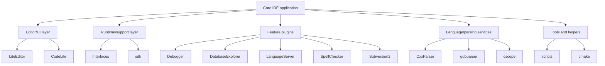
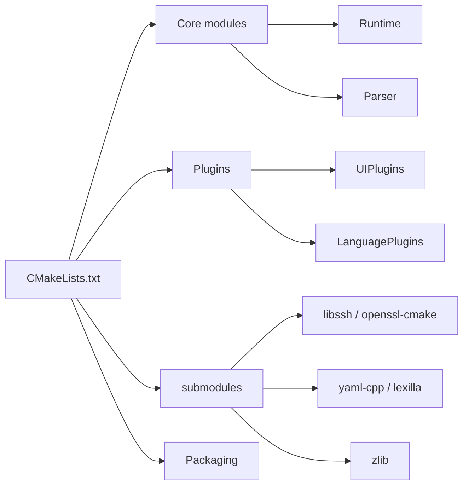

# Architecture

## Overview
CodeLite follows a modular desktop IDE architecture built around a core editor/application layer with many optional feature modules. The root CMake build coordinates these modules and integrates third-party libraries through git submodules.

## Architectural characteristics
- Modular monorepo layout with separate directories per subsystem.
- Core UI/editor functionality is isolated from feature plugins and utilities.
- Build-time composition is driven by CMake rather than a single application framework project file.
- Platform-specific behavior is handled in build logic and packaging helpers.
- Parser, completion, debugger, and language-support capabilities are split into dedicated components.

## System structure

## Design patterns observed
- Plugin-oriented extension model.
- Separation of concerns between editor, runtime, and service modules.
- Dependency injection is not directly evidenced by the top-level files reviewed; integration appears to happen through linked modules and plugin APIs.
- External libraries are vendored as submodules to stabilize builds across platforms.

## Build architecture
- Root `CMakeLists.txt` defines global constraints, toolchain requirements, and shared options.
- Each major module exposes its own `CMakeLists.txt`, allowing incremental composition.
- `compile_commands.json` is generated for language tooling.
- Platform-specific branches control install prefix behavior and dependency checks.

## Mermaid dependency view

