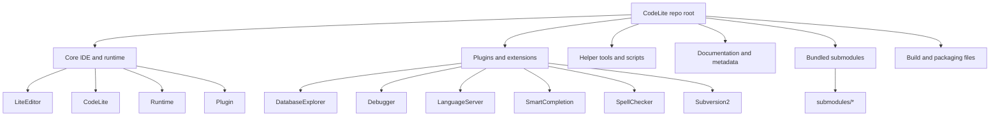

# Codebase Information

## Scope
- Repository: CodeLite IDE
- Path: `{{workspace_path}}`
- Primary build system: CMake
- Primary product: cross-platform IDE and supporting tools/plugins

## High-level observations
- The repository is organized around a core IDE plus many feature modules and plug-ins.
- The build is centered on `CMakeLists.txt` at the repository root and many module-specific `CMakeLists.txt` files.
- The codebase includes a substantial set of bundled third-party libraries under `submodules/`.
- Supported main implementation languages appear to include C++ and Python, with some auxiliary PHP, Lua, Rust, and JSON/YAML/configuration assets.
- This repository includes platform-specific tooling and packaging support for Windows/MSYS2, Linux, and macOS.

## Major top-level areas

## Notable directories and roles
- `LiteEditor/`, `CodeLite/`, `Runtime/`, `Plugin/`: primary IDE implementation layers.
- Feature modules such as `Debugger/`, `DatabaseExplorer/`, `LanguageServer/`, `SmartCompletion/`, `SpellChecker/`, `Subversion2/`, `QmakePlugin/`, `CMakePlugin/`, `Rust/`, `PHPLint/`, `PHPRefactoring/`.
- Support libraries and SDKs: `sdk/`, `Interfaces/`, `PCH/`, `CxxParser/`, `gdbparser/`, `cscope/`, `outline/`-style components.
- Packaging/build helpers: `cmake/`, `scripts/`, `Docker/`, `InnoSetup/`, `MacBundler/`, `weekly/`, `BuildInfo.txt`.
- Documentation and metadata: `docs/`, `README.md`, `TODO.md`, `AUTHORS`, `COPYING`, `LICENSE*`.
- External dependencies: `submodules/` and assorted bundled components like `libssh`, `yaml-cpp`, `zlib`, `lua`, `lexilla`, `wxTerminalEmulator`.

## Technology stack
- C++20 for the main application code.
- CMake for build orchestration.
- wxWidgets-based desktop UI architecture.
- SQLite3 dependency is required by the top-level build.
- Bison and Flex are required for parser generation.
- Git submodules are used for many external dependencies.

## Supported language/tooling surface
- Supported project/tool integrations in the repo README and module layout: C, C++, Rust, Python, Node.js, PHP.
- Configuration and metadata formats: CMake, JSON, YAML, Markdown, workspace files, XML, shell/batch scripts, Python scripts.
- Likely unsupported or not primary: compiled languages not represented by modules; no evidence of first-class support for Java, Go, or .NET in the main repository structure.

## Key integration points
- `CMakeLists.txt` defines the build configuration and toolchain requirements.
- `compile_commands.json` is generated for code completion and tooling.
- `.gitmodules` identifies bundled upstream dependencies.
- Workspace files such as `CodeLiteIDE-*.workspace` show IDE project organization.
- `README.md` and `docs/` provide user-facing setup information.

## Architecture notes
- The repository uses a modular monorepo layout with the core IDE and feature plugins split into separate directories.
- The build includes platform-specific branches and packaging logic.
- Parser and language services are split into dedicated components rather than embedded in the UI layer.

## Mermaid structural map

```mermaid
graph TB
  A[Root build files] --> B[Core app modules]
  A --> C[Feature plugins]
  A --> D[Infrastructure libraries]
  A --> E[Packaging and scripts]
  A --> F[Third-party submodules]

  B --> B1[LiteEditor]
  B --> B2[CodeLite]
  B --> B3[Runtime]
  B --> B4[Plugin]

  C --> C1[Debugger]
  C --> C2[DatabaseExplorer]
  C --> C3[LanguageServer]
  C --> C4[SmartCompletion]
  C --> C5[SpellChecker]
  C --> C6[Subversion2]

  D --> D1[Interfaces]
  D --> D2[sdk]
  D --> D3[CxxParser]
  D --> D4[gdbparser]
  D --> D5[PCH]

  E --> E1[cmake]
  E --> E2[scripts]
  E --> E3[Docker]
  E --> E4[InnoSetup]
  E --> E5[MacBundler]

  F --> F1[libssh]
  F --> F2[yaml-cpp]
  F --> F3[zlib]
  F --> F4[lua]
  F --> F5[lexilla]
```

