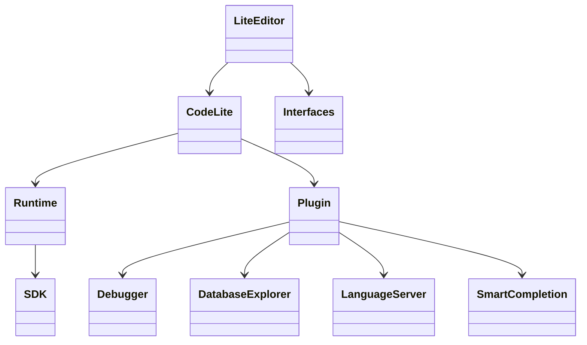

# Components

## Core areas
| Component | Responsibility | Notes |
|----------|----------------|------|
| `LiteEditor/` | Main IDE/editor application | Likely central UI and editing workflows. |
| `CodeLite/` | Core application framework and shared IDE logic | Paired with `LiteEditor` in the repo layout. |
| `Runtime/` | Shared runtime support | Used by templates and generated projects. |
| `Plugin/` | Plugin base and shared plugin interfaces | Foundation for modular extensions. |
| `Interfaces/` | Common interfaces and contracts | Integration surface between modules. |
| `sdk/` | Shared SDK/libraries | Includes data layer and other reusable code. |

## Feature modules
- `Debugger/`: debugger integration and workflows.
- `DatabaseExplorer/`: database browsing and related tooling.
- `LanguageServer/`: language server integration.
- `SmartCompletion/`: code completion and symbol assistance.
- `SpellChecker/`: spelling support in the editor.
- `Subversion2/`, `git/`: version control integrations.
- `QmakePlugin/`, `CMakePlugin/`, `wxcrafter/`, `wxformbuilder/`: build and GUI tooling integrations.
- `Rust/`, `PHPLint/`, `PHPRefactoring/`, `codelitephp/`: language-specific tooling.
- `ExternalTools/`, `ContinuousBuild/`, `AutoSave/`, `ZoomNavigator/`, `WordCompletion/`: productivity and utility extensions.

## Component relationships

## Navigation hints
- Search in the module directory named after the feature you want to change.
- For cross-cutting behavior, inspect `Plugin/`, `Interfaces/`, and `Runtime/` first.
- For parser-related issues, look at `CxxParser/`, `gdbparser/`, and `cppchecker/`.
