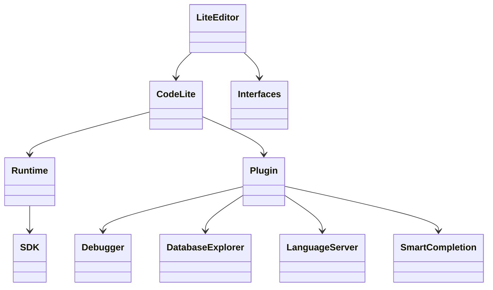

# Components

## Core areas
| Component | Responsibility | Notes |
|----------|----------------|------|
| `LiteEditor/` | Main IDE/editor application | Likely central UI and editing workflows. |
| `CodeLite/` | Core application framework and shared IDE logic | Paired with `LiteEditor` in the repo layout. |
| `Runtime/` | Shared runtime support | Used by templates and generated projects. |
| `Plugin/` | Plugin base and shared plugin interfaces | Foundation for modular extensions. |
| `Interfaces/` | Common interfaces and contracts | Integration surface between modules. |
| `sdk/` | Shared SDK/libraries | Includes data layer and other reusable code. |

## Feature modules
All plug-ins live under `Plugins/`; `Plugins/CMakeLists.txt` lists them and shows which are platform-specific.
- `Plugins/Debugger/`, `Plugins/DebugAdapterClient/`: debugger integration (GDB and DAP).
- `Plugins/DatabaseExplorer/`: database browsing and related tooling.
- `Plugins/LanguageServer/`: language server integration.
- `Plugins/SmartCompletion/`: code completion and symbol assistance.
- `Plugins/SpellChecker/`: spelling support in the editor.
- `Plugins/Subversion2/`, `Plugins/git/`: version control integrations.
- `Plugins/QmakePlugin/`, `Plugins/CMakePlugin/`, `Plugins/wxCrafter/`, `Plugins/wxformbuilder/`: build and GUI tooling integrations.
- `Plugins/Rust/`, `Plugins/codelitephp/`: language-specific tooling.
- `Plugins/Remoty/`, `Plugins/SFTP/`, `Plugins/Docker/`: remote and container workflows.
- `Plugins/ExternalTools/`, `Plugins/ContinuousBuild/`, `Plugins/AutoSave/`, `Plugins/ZoomNavigator/`, `Plugins/WordCompletion/`: productivity and utility extensions.

Note: top-level `wxcrafter/` holds the wxCrafter shared libraries and standalone app, not the plug-in.

## Component relationships

```mermaid
classDiagram
  class LiteEditor
  class CodeLite
  class Runtime
  class Plugin
  class Interfaces
  class SDK
  class Debugger
  class DatabaseExplorer
  class LanguageServer
  class SmartCompletion

  CodeLite --> Runtime
  CodeLite --> Plugin
  LiteEditor --> CodeLite
  LiteEditor --> Interfaces
  Plugin --> Debugger
  Plugin --> DatabaseExplorer
  Plugin --> LanguageServer
  Plugin --> SmartCompletion
  Runtime --> SDK
```

## Navigation hints
- Search in the `Plugins/` subdirectory named after the feature you want to change.
- For cross-cutting behavior, inspect `Plugin/`, `Interfaces/`, and `Runtime/` first.
- For parser-related issues, look at `CxxParser/`, `Plugins/gdbparser/`, and `Plugins/cppchecker/`.
