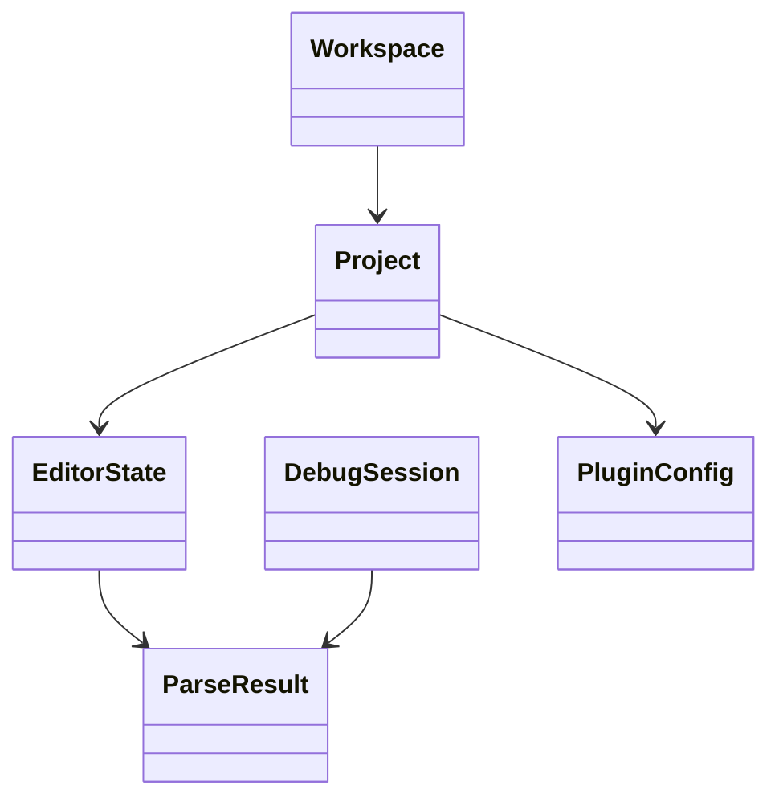

# Data Models

## Overview
The repository contains several categories of data models rather than a single centralized schema. The most visible model families relate to project metadata, editor state, parser outputs, debugger state, and plugin configuration.

## Major model families
- Project/workspace metadata used by the IDE and its templates.
- Editor state and syntax/formatting configuration.
- Parser and code-indexing data used by completion, navigation, and diagnostics.
- Debugger and process state models.
- Database and external-tool configuration records.

## Mermaid conceptual model

## Observations
- Some models are persisted in configuration files or workspace/project files rather than in a single database schema.
- The repository appears to use multiple data representations depending on subsystem needs, including XML-like workspace/project files and module-specific configuration formats.
- Further model extraction would require module-by-module inspection of the feature directories.
