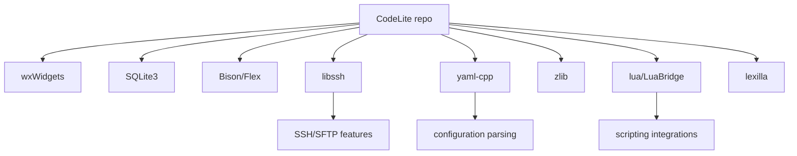

# Dependencies

## External dependencies
- wxWidgets: primary GUI toolkit implied by the project structure and build notes.
- SQLite3: required by the top-level CMake configuration.
- Bison and Flex: required for parser generation.
- libssh: bundled through submodules for SSH/SFTP-related features.
- yaml-cpp: bundled for YAML parsing support.
- zlib: bundled compression dependency.
- lua and LuaBridge: bundled scripting support.
- lexilla: bundled lexical analysis support.
- wxTerminalEmulator, wxdap, assistant, cc-wrapper, doctest, and others: bundled dependency submodules supporting specific features or tests.

## Mermaid dependency map

## Notes
- Dependency management relies heavily on git submodules.
- Several submodules also contain their own test and example trees, which are not part of the main product surface.
- The build checks for essential tools early and fails fast if required packages are missing.
