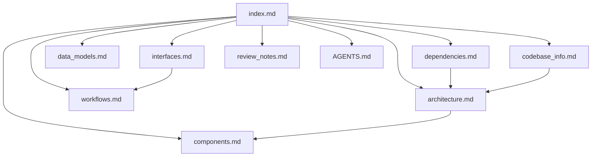

# Codebase Knowledge Base Index

This document is the primary entry point for AI assistants working in the CodeLite repository.
Use it to decide which supporting document to consult before answering or editing code.

## How to use this knowledge base
1. Start here to identify the most relevant document(s).
2. Open the focused document for the area you need.
3. Use `codebase_info.md` for the overall map and technology stack.
4. Consult `review_notes.md` for gaps, limitations, and inconsistencies.
5. If you need repo navigation guidance, prefer the consolidated `AGENTS.md` in the repository root.

## Document map
| File | Purpose | When to consult | Summary |
|------|---------|-----------------|---------|
| `codebase_info.md` | Repository overview and structural map | First pass, repo orientation | High-level stack, directory roles, language support, and Mermaid structure map. |
| `architecture.md` | System design and patterns | Understanding subsystems and boundaries | Describes the modular IDE architecture, build structure, and integration style. |
| `components.md` | Major components and responsibilities | Locating code ownership areas | Summarizes core modules and feature plugins. |
| `interfaces.md` | APIs, interfaces, integration points | Working on cross-module boundaries | Lists build-time and runtime integration surfaces. |
| `data_models.md` | Data structures and models | Working on shared types and persistent data | Focuses on the main categories of models used across the repo. |
| `workflows.md` | Key processes and workflows | Understanding how the system behaves end-to-end | Covers build, plugin loading, parsing, and tool workflows. |
| `dependencies.md` | External dependencies and their usage | Investigating third-party components | Summarizes bundled and required external libraries. |
| `review_notes.md` | Consistency/completeness review | Checking documentation quality | Captures gaps, caveats, and recommendations. |
| `AGENTS.md` | Repository navigation guidance for agents | Repo-local working context | Concise navigation hints and agent workflow guidance. |

## Guidance for AI assistants
- Use `AGENTS.md` for quick navigation and repository-specific workflow notes.
- Use `codebase_info.md` to understand the project shape before diving into details.
- Use the focused topic file that matches the question:
  - Architecture or design questions -> `architecture.md`
  - Component ownership or module location -> `components.md`
  - API/interface questions -> `interfaces.md`
  - Data structure questions -> `data_models.md`
  - Process or sequence questions -> `workflows.md`
  - Dependency questions -> `dependencies.md`
- If a question spans multiple areas, consult the index first, then combine the relevant topic files.

## Relationships between documents

## Metadata notes
- Repository-wide documentation is organized under `.agents/summary/`.
- Consolidated agent guidance is written to the repository root as `AGENTS.md`.
- Mermaid diagrams are used instead of ASCII art for relationships and structure.
