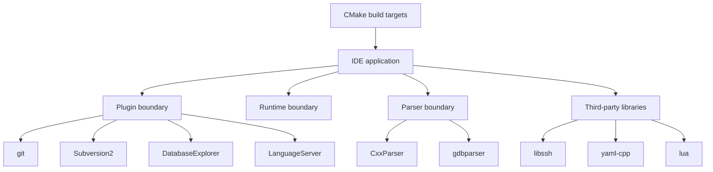

# Interfaces

## Primary integration surfaces
- CMake build targets defined across root and module-specific `CMakeLists.txt` files.
- Plugin interfaces under `Plugin/` and shared contracts under `Interfaces/`.
- Generated code and parser interfaces from `CxxParser/`, `gdbparser/`, and related tools.
- Language tooling and editor integration points in `SmartCompletion/`, `LanguageServer/`, and feature plugins.
- External library boundaries through `submodules/`.

## Important integration points
| Surface | Role | Examples |
|--------|------|----------|
| Build configuration | Composes modules into the app | Root `CMakeLists.txt`, module `CMakeLists.txt` files |
| Plugin API | Connects optional features to the IDE | `Plugin/`, feature module directories |
| Parser/tool interfaces | Support analysis and code intelligence | `CxxParser/`, `gdbparser/`, `cppchecker/` |
| Editor/runtime contracts | Shared behavior across modules | `Runtime/`, `Interfaces/`, `sdk/` |
| External dependencies | Third-party code linked into the build | `submodules/libssh`, `submodules/yaml-cpp`, `submodules/zlib`, `submodules/lua` |

## Mermaid interface map

## Notes
- The repository is strongly coupled to its build system; many interfaces are expressed through build targets and linked modules.
- Detailed API signatures were not exhaustively enumerated from the limited top-level sampling, so this file focuses on stable integration surfaces.
