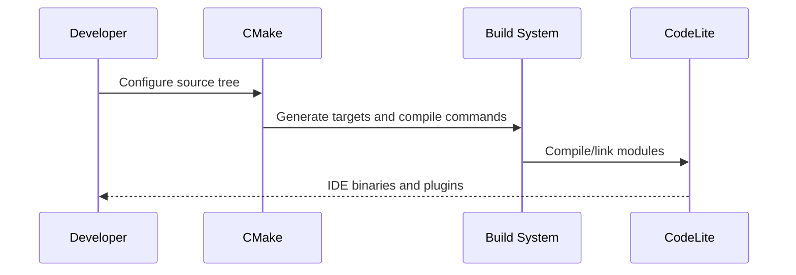
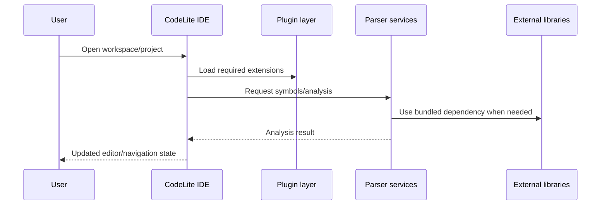

# Workflows

## Key workflows
- Build and configure the IDE with CMake.
- Load editor, runtime, and plugin subsystems on startup.
- Resolve parser and completion services for source navigation.
- Connect debugger and version-control plugins through shared interfaces.
- Use bundled tooling and templates to generate or manage projects.

## Build workflow

## Runtime workflow

## Tooling workflows
- Templates and runtime support are used for generated project scaffolding.
- Platform-specific packaging is handled by separate helper directories.
- Language-specific services are delegated to their respective modules rather than centralized in the editor core.
