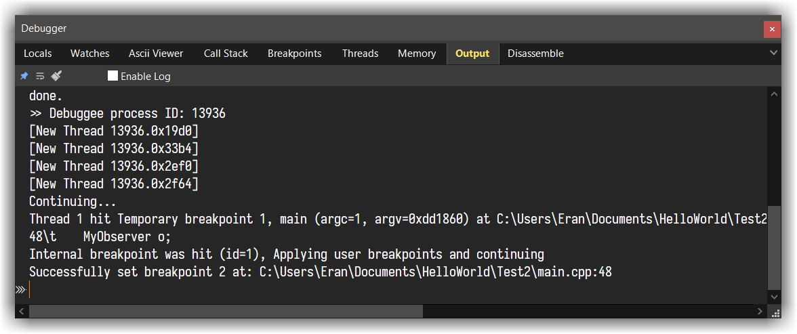
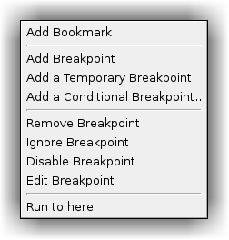
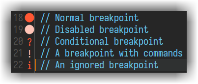
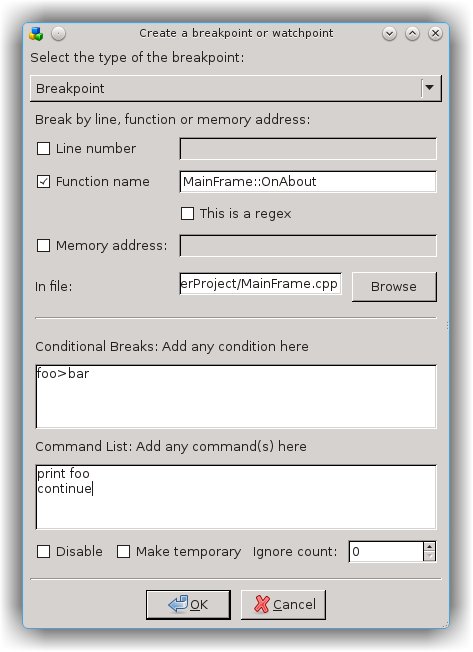
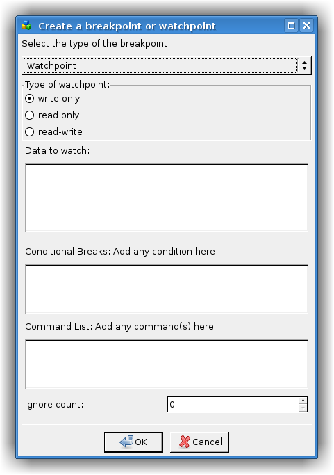

# gdb

## The Debugger View
---

When the debugger starts, the `Debugger` View appears (at the bottom of CodeLite by default) with multiple tabs.



Tab Name    | Description |
------------|-------------|
`Locals`    | Display a table / tree view of the current stack local variables + `this`|
`Watches`   | Similar to the `Locals` tab, items displayed here needs to be added manually|
`Ascii Viewer`| Display raw view (without manipulating the output) of the item under the cursor|
`Call stack`| Display the program frames. Double clicking a line in the table will switch to that frame|
`Breakpoints`|List all breakpoints for the current debug session|
`Threads`| List all threads of the debuggee |
`Memory`| Show hex view of a given address |`
`Output`| Show the interaction between CodeLite and gdb. This view is also interactive and you can interact with the debugger from this view. You also set `Enable full debugger logging` here to increase the verbosity level of the interaction (useful for debugging)|
`Disassemble`| Show assembly code for the current stack|

## Interacting with the debugger
---

Once the debugger is running a new toolbar will appear at the top left.
You can Pause, Continue and Stop it from that toolbar.


When a breakpoint has been hit, you will often want to step through the next lines of code.
The commands `Next`, `Step In` and `Step Out` (Finish) are available as keyboard shortcuts and from the Debug menu;
there are also `Next` and `Step In` tools in the Debug section of the toolbar.
The green "You are Here" arrow in the editor margin indicates which line is the current one.
If you have been inspecting other parts of the source code, clicking the `Show Current Line` tool takes you back to that arrow

 Key |gdb's command |Description
--------|-------|---------------
++f5++ | run/cont| Start the debugger, or Continue debugging after an Interrupt
++f10++| next | Step over
++f11++| step | Step into function
++shift+f11++| finish | Finish the execution of the current function (Step out)
++f9++ | `b file:line`| Insert or remove a breakpoint at the current line

In addition to the above, when the debugger starts up, a terminal window appears.
This is normally just a nuisance, but it is where you'll find the output from `stdout`, `stderr` etc.
You can also use it to supply input, for those rare situations where it's needed.

## Breakpoints
---

### Using Breakpoints

During a debugging session, CodeLite can set breakpoints, temporary breakpoints and watchpoints. These can be conditional,
ignored or disabled, and can be associated with command-lists. Breakpoints can be set by file/line-number, function or memory address.

### Setting Breakpoints

#### Setting Breakpoints by line-number

This is the commonest type of breakpoint, and there are three ways to set one. The easiest is to click on the left margin
of that line, just to the right of the line-number. This creates a new breakpoint on that line. Clicking on a line which
already has a breakpoint deletes the breakpoint. Exactly the same could be done by using the `Debug` &#8594; `Toggle Breakpoint`
menuitem, or the associated shortcut, ++f9++ by default.

Another way is via the margin's context menu. As well as adding a normal breakpoint, this also lets you add a temporary
or a conditional one. If, as shown, the right-click was over an existing breakpoint, there are also options to remove,
ignore, edit and disable that breakpoint.

*Below, margin context menu:*



The third way to add a line-number breakpoint is from the Breakpoints tab of the Debugger pane, as described below.
A breakpoint on a line is indicated by an icon in the margin. There are icons for each type of breakpoint:



!!! Tip
    A breakpoint icon's tooltip displays information about the breakpoint e.g. its condition or commands

#### Setting other types of Breakpoint

Setting a breakpoint on a function or at a memory address can only be done from the 'Create a breakpoint...' dialog.
To run this dialog, click the `Add` button in the `Breakpoints` tab of the debugger view



This dialog lets you add a breakpoint by line-number/file as above, or by function e.g. `MyClass::Foo` or memory e.g. `0x12345678`.
At the same time you can add any condition e.g. `n < 2`, and/or commands to run when the breakpoint is hit. You can also
make the breakpoint be disabled, temporary, or set its ignore level

### Editing Breakpoints
---

If you right-click over a breakpoint symbol, the resulting context menu allows you to set the 'ignore' level of the breakpoint and to disable/enable it.
You can also edit a breakpoint using a version of the `Create a breakpoint...` dialog. To obtain this:

- Choose `Edit` from the breakpoint's context menu
- ++right-button++ the breakpoint's entry in the Breakpoints tab of the Debugger Pane
- Select it in that tab and click `Edit`

### Miscellaneous
---

You can create and edit a breakpoint even before the debugger starts. Similarly, existing breakpoints will remembered by
CodeLite when the debugging session finishes; indeed they are serialised.

If you have a breakpoint, and you need it on a different line, you can move it there by drag-and-drop, using ++shift+left-button++
That's not particularly exciting if it's just a standard breakpoint (it would have been at least as easy to delete it and
create a new one); but if the breakpoint has complicated commands or conditions, it saves you having to enter these again

You may wish to set breakpoints inside a shared library that will be loaded by your program. In theory, you can warn gdb
that you're doing this by checking the `Enable pending breakpoints` box in the Debugger Settings dialog
(`Settings` &#8594;  `GDB Settings` &#8594; `General`); in practice this
doesn't always work. So CodeLite stores any breakpoints that gdb can't apply; when this happens, an extra button appears
in the Breakpoints tab of the Debugger Pane, `Set Pending`. Clicking this tells gdb to try again; if it succeeds, the
button will disappear again and the breakpoint entries and markers will become visible.

The dialog is identical to the `Create` one, except that there's an extra option of disabling/enabling the breakpoint
This dialog has informative tooltips, to help you set more complex breakpoints correctly.

## Watchpoints
---



A watchpoint is similar to a breakpoint but, instead of breaking when that code is hit, it breaks when a variable (or an
area of memory) is changed or accessed [see here for more information][1]

You can only set a watchpoint from the `Create a breakpoint...` dialog as described above. Use the choice at the top of
the dialog to create a watchpoint instead. Again the tooltips should be helpful

!!! Note
    The most common situation for wanting to use a watchpoint is to watch for alterations to a variable.
    However, as soon as that variable loses scope, gdb deletes the watchpoint. This makes it difficult to watch a local variable.

## Context menus
---

Once the debug-session starts, the editor context menu (right-click menu), offers extra options:

- `Run to cursor` - instructs the debugger to resume debugging, then break at the line containing the cursor.
- `Add Watch` - adds the currently selected item (or if there's no selection, it uses the word under the cursor) to the Watches tab.
- `Jump to caret line` - skip execution direcrly to a specific line in the source code

Even when the debugger isn't running, right-clicking on a margin gives the opportunity to enter a breakpoint.
Once it is running, Run to here is available too.


## Pretty printing
---

GDB pretty printing is a gdb feature that allows gdb to display complex objects (and other containers) in a more friendly way.
For example, when gdb pretty printing is disabled, viewing an STL map is pretty much useless. Consider the following code:

```c++
typedef std::map<std::string, int> StringToIntMap_t;
...
StringToIntMap_t mymap;
mymap.insert({"String One", 1});
mymap.insert({"String Two", 2});
mymap.insert({"String Three", 3});
```

Without pretty printing enabled, viewing `mymap` in the Locals view will give you this:


Once enabled from: `Settings` &#8594; `GDB Settings` &#8594; `Display` &#8594; `Enable GDB Pretty printing`
The display view changes into this:


### Setting up pretty printing

!!! IMPORTANT
    Before you can enable this feature within CodeLite, make sure that your `gdb` supports `python` (on most Linux systems this is the default)


- Make sure to point CodeLite to the correct gdb. You can do this from the main menu `Settings` &#8594; `GDB Settings` &#8594; `GNU gdb debugger` &#8594; `General` and select the new gdb in the `Debugger path` field.
- Once everything is set up properly, go to CodeLite's menu bar: `Settings` &#8594; `GDB Settings` &#8594; `GNU gdb debugger` &#8594; `General` and enable the option `Enable GDB pretty printing`
- Still in the gdb settings dialog, switch to the `Startup commands` tab and paste the following content:

```python

python
import sys
sys.path.insert(0, "${CODELITE_GDB_PRINTERS_DIR}")
from libstdcxx.v6.printers import register_libstdcxx_printers
from wx import register_wx_printers
end

```

!!! IMPORTANT
    Note: make sure to replace `PATH_TO_CODELITE_SETTINGS_FOLDER` with the correct path to your `gdb_printers`
    (CodeLite creates this directory when it is launched for the first time). Under Linux, you should replace it with:
    `~/.codelite/gdb_printers`, and under Windows it will be `%APPDATA%/CodeLite/gdb_printers`

!!! IMPORTANT
    Under Windows, make sure you use forward slashes to your `gdb_printers` directory
    so it should look something like this: `C:/Users/you/AppData/Roaming/codelite/gdb_printers`

`Click` `OK` and on the next debugging session, your pretty printing should be enabled

## macOS - codesign gdb
---

On macOS you will need to codesign your gdb executable.

First, install the latest `gdb` using `brew`:

- `brew install gdb`
- Copy the below content into a script `macos-codesign-gdb.sh` and give it execution permission `chmod +x macos-codesign-gdb.sh`

```bash
#!/bin/bash

CERT="gdb_codesign"

function error() {
    echo error: "$@"
    exit 1
}

function cleanup {
    # Remove generated files
    rm -f "$TMPDIR/$CERT.tmpl" "$TMPDIR/$CERT.cer" "$TMPDIR/$CERT.key" > /dev/null 2>&1
}

trap cleanup EXIT

# Check if the certificate is already present in the system keychain
security find-certificate -Z -p -c "$CERT" /Library/Keychains/System.keychain > /dev/null 2>&1
if [ $? -eq 0 ]; then
    echo Certificate has already been generated and installed
    exit 0
fi

# Create the certificate template
cat <<EOF >$TMPDIR/$CERT.tmpl
[ req ]
default_bits       = 2048        # RSA key size
encrypt_key        = no          # Protect private key
default_md         = sha512      # MD to use
prompt             = no          # Prompt for DN
distinguished_name = codesign_dn # DN template
[ codesign_dn ]
commonName         = "$CERT"
[ codesign_reqext ]
keyUsage           = critical,digitalSignature
extendedKeyUsage   = critical,codeSigning
EOF

echo Generating and installing gdb_codesign certificate

# Generate a new certificate
openssl req -new -newkey rsa:2048 -x509 -days 3650 -nodes -config "$TMPDIR/$CERT.tmpl" -extensions codesign_reqext -batch -out "$TMPDIR/$CERT.cer" -keyout "$TMPDIR/$CERT.key" > /dev/null 2>&1
[ $? -eq 0 ] || error Something went wrong when generating the certificate

# Install the certificate in the system keychain
sudo security add-trusted-cert -d -r trustRoot -p codeSign -k /Library/Keychains/System.keychain "$TMPDIR/$CERT.cer" > /dev/null 2>&1
[ $? -eq 0 ] || error Something went wrong when installing the certificate

# Install the key for the certificate in the system keychain
sudo security import "$TMPDIR/$CERT.key" -A -k /Library/Keychains/System.keychain > /dev/null 2>&1
[ $? -eq 0 ] || error Something went wrong when installing the key

# Kill task_for_pid access control daemon
sudo pkill -f /usr/libexec/taskgated > /dev/null 2>&1

# Exit indicating the certificate is now generated and installed
exit 0
```

- Run the script
- Open the `Keychain Access` application, locate the `gdb_codesign` certificate, double click it and change the `Trust` to `Always Trust`
- On macOS Mojave and later, you will also need:

### `macOS Mojave` and later
---

- Create a file named `gdb.xml` with the following content

```xml

<?xml version="1.0" encoding="UTF-8"?>
<!DOCTYPE plist PUBLIC "-//Apple//DTD PLIST 1.0//EN" "http://www.apple.com/DTDs/PropertyList-1.0.dtd">
<plist version="1.0">
<dict>
    <key>com.apple.security.cs.debugger</key>
    <true/>
</dict>
</plist>
```
- Reboot your mac

- Save it and run codesign: `codesign --entitlements gdb.xml -fs gdb_codesign /usr/local/bin/gdb`

### macOS older than `macOS Mojave`
---

- codesign `gdb` like this: `codesign -fs gdb_codesign /usr/local/bin/gdb`
- Reboot your mac


[1]: http://www.delorie.com/gnu/docs/gdb/gdb_30.html
