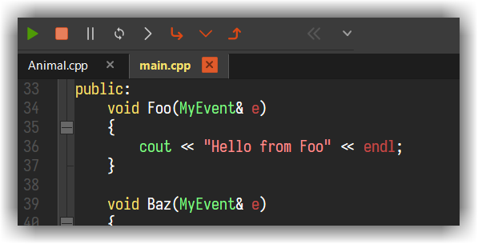

# gdb

## The Debugger View
---

When the debugger starts, the `Debugger` View appears (at the bottom of CodeLite by default) with multiple tabs.

Tab Name    | Description |
------------|-------------|
`Locals`    | Display a table / tree view of the current stack local variables + `this`|
`Watches`   | Similar to the `Locals` tab, items displayed here needs to be added manually|
`Ascii Viewer`| Display raw view (without manipulating the output) of the item under the cursor|
`Call stack`| Display the program frames. Double clicking a line in the table will switch to that frame|
`Breakpoints`|List all breakpoints for the current debug session|
`Threads`| List all threads of the debuggee |
`Memory`| Show hex view of a given address |`
`Output`| Show the interaction between CodeLite and gdb. This view is also interactive and you can interact with the debugger from this view. You also set `Enable full debugger logging` here to increase the verbosity level of the interaction (useful for debugging)|
`Disassemble`| Show assembly code for the current stack|

## Interacting with the debugger
---

Once the debugger is running a new toolbar will appear at the top left.
You can Pause, Continue and Stop it from that toolbar. 

When a breakpoint has been hit, you will often want to step through the next lines of code. 
The commands `Next`, `Step In` and `Step Out` (Finish) are available as keyboard shortcuts and from the Debug menu; 
there are also `Next` and `Step In` tools in the Debug section of the toolbar. 
The green "You are Here" arrow in the editor margin indicates which line is the current one. 
If you have been inspecting other parts of the source code, clicking the `Show Current Line` tool takes you back to that arrow

 Key |gdb's command |Description
--------|-------|---------------
++f5++ | run/cont| Start the debugger, or Continue debugging after an Interrupt
++f10++| next | Step over
++f11++| step | Step into function
++shift+f11++| finish | Finish the execution of the current function (Step out)
++f9++ | `b file:line`| Insert or remove a breakpoint at the current line

In addition to the above, when the debugger starts up, a terminal window appears. 
This is normally just a nuisance, but it is where you'll find the output from `stdout`, `stderr` etc. 
You can also use it to supply input, for those rare situations where it's needed.

## Context menus
---

Once the debug-session starts, the editor context menu (right-click menu), offers extra options:

- `Run to cursor` - instructs the debugger to resume debugging, then break at the line containing the cursor.
- `Add Watch` - adds the currently selected item (or if there's no selection, it uses the word under the cursor) to the Watches tab.
- `Jump to caret line` - skip execution direcrly to a specific line in the source code

Even when the debugger isn't running, right-clicking on a margin gives the opportunity to enter a breakpoint. 
Once it is running, Run to here is available too.