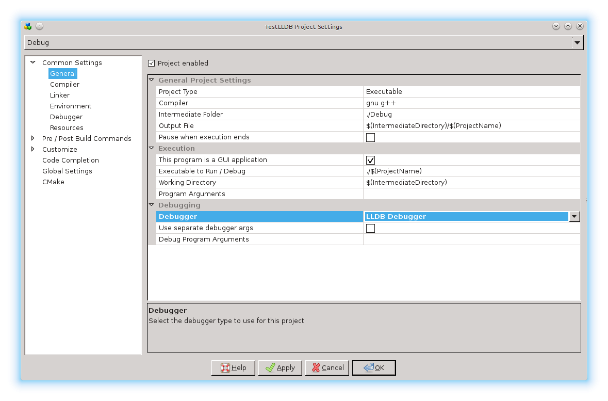
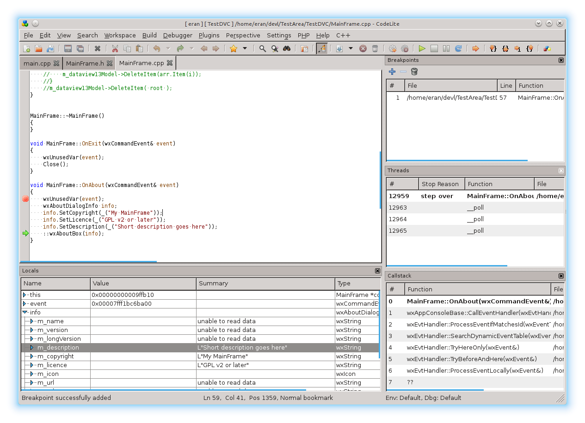
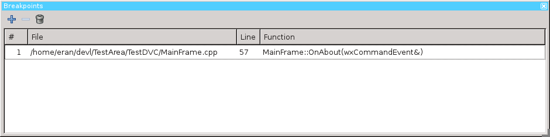
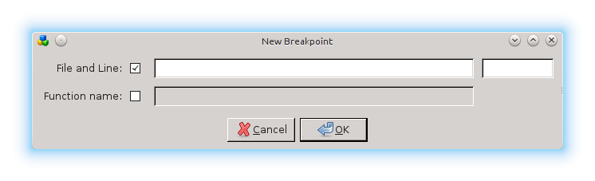
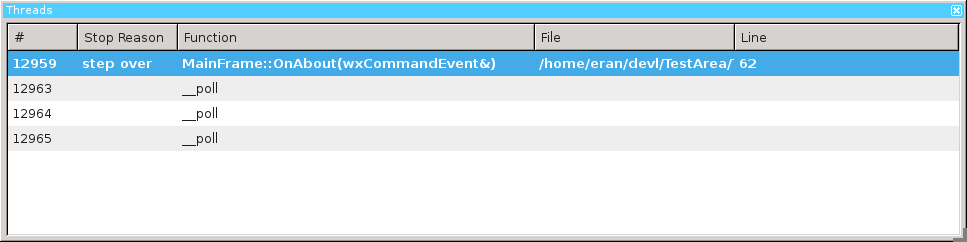
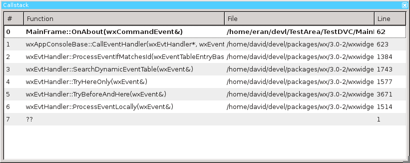
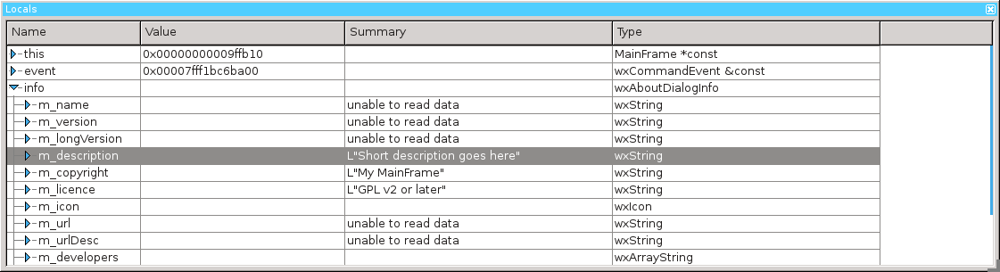
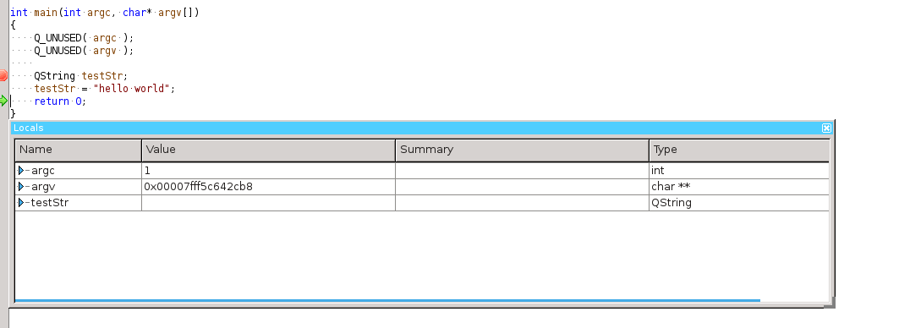
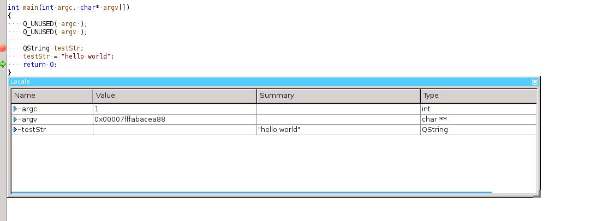

## Introduction
---

LLDB is a next generation, high-performance debugger. It is built as a set of reusable components which highly leverage existing libraries in the larger LLVM Project, such as the Clang expression parser and LLVM disassembler. 
LLDB is now the default debugger on macOS and supports debugging C, Objective-C and C++ on the desktop and iOS devices and simulator. 

## Under the hood
---

In this section I will attempt the explain the design chosen for the implementation of the LLDB debugger plugin, and the rationale behind it. 
CodeLite uses a small executable named `codelite-lldb` that does the actual debugging. 
The plugin communicates with the executable over a UNIX Domain Socket or over TCP/IP (this is configurable).

The `codelite-lldb` executable is sometimes refers to as the Proxy process

This design was chosen to accomplish three main goals:

- Allow remote debugging between two different machines (e.g. you can use CodeLite running on Windows to debug a process running on Linux)
- Allow one user to debug locally a process belonging to another user (e.g. user eran can debug processes owned by root ) - this is covered below
- Avoid crashing CodeLite if LLDB crashes (which does happen :( - for example when attempting to debug an executable with DWARF optimized by `g++` that `clang++` cannot handle) 

For a simple debug session (i.e. no remote debugging and no cross-user debugging) there is 0 (zero) configuration needed to be done by the user

## Changing the project to use lldb
---

Selecting LLDB as the default debugger for a project is easily done from the project settings: right-click on the project and navigate to 
`Settings` &#8594; `Common Settings` &#8594; `General` Under the Debugging section, select the debugger to be LLDB Debugger, as shown below:



Of course, you can also select LLDB as your debugger from the following dialogs:

- Quick Debug ( From the menu bar: `Debugger` &#8594; `Quick Debug` )
- Debug Core File ( From the menu bar: `Debugger` &#8594; `Debug a core dump` )
- Attach to Process ( From the menu bar: `Debugger` &#8594; `Attach to process` ) 

!!! Tip
    You can also select `lldb` as your debugger when creating a new project
    
## The LLDB Perspective
---

At the time of writing this document, LLDB manages its own perspective layout. 
The perspective is loaded/unloaded automatically when the debug session starts. 
At the moment, all 4 LLDB panes will be shown each time you start a debug session (this might change in the future).

Below is a screenshot of the typical LLDB layout during debug session: 



### Bbreakpoints view



This is the typical breakpoints pane, similar to the GDB one (though with fewer options). You can choose whether to:

- Add a new breakpoint
- Delete the selected breakpoint
- Delete all breakpoints 

When clicking on the `+` button, you will be prompted with the `Add New Breakpoint` dialog:



You can define breakpoints in 2 ways:

- By name (e.g. function name). Note that such a breakpoint might have multiple locations. You can also specify the function scope for example `MyClass::Foo`
- By `file:line` pair

Double-clicking a breakpoint entry will jump to its location. 

### Threads view



The thread view provides information about the threads running in your program. Double-clicking on a thread will make it active (i.e. the call-stack view will be updated to reflect that thread's backtrace). 
The active thread is shown in **bold** 

### Callstack view



This view displays the active thread's frames (aka backtrace). 
The active frame is presented in **bold**. The Locals View will always show that frame's variables (function arguments, local arguments and `this`). 
To switch between frames, double-click on the frame you want to view. 

### Locals View



This view displays the active frame variables:

- Function arguments
- The `this` keyword
- Local variables defined within the current frame's scope 

### Data formatters

To read about LLDB data formatters, please read [this article][1] from the LLDB website.

When a debug session starts, the plugin will "source" the file `~/.lldbinit` so you should place there any custom commands 
to be executed before the session starts. This is where you want to place your python printers.

#### Python printers

Similar to [gdb pretty printers](gdb.md#setting-up-pretty-printing), `lldb` also offers python based pretty printers

One of the features of LLDB is python printers. You can use python to provide an alternate "summary" field which will be displayed in the Locals View.

As an example for such printer, consider the QString class from the Qt framework.

- `QString` stores the string internally as `utf16`
- The member pointer of of type `unsigned short*`

Without defining a python printer, all you will be able view is the pointer address, which is useless...

Instead, in your `~/.lldbinit` file add this line:

```bash
command script import ~/.lldb/qstring.py
```

Next, create the file `~/.lldb/qstring.py` and copy the following content:

```python

import lldb

def utf16string_summary(value, *rest):
    str_data = value.GetChildMemberWithName("d").GetChildMemberWithName("data")
    if str_data is None:
        return '""'
    length_vo = value.GetChildMemberWithName("d").GetChildMemberWithName("size")
    length = length_vo.GetValueAsUnsigned(0)
    if length == 0:
        return '""'
    data = str_data.GetPointeeData(0, length)
    error = lldb.SBError()
    bytes = data.ReadRawData(error, 0, 2*length)
    return '"%s"' % (bytes.decode('utf-16').encode('utf-8'))

def __lldb_init_module(debugger, *rest):
    print "registering QString"
    summary = lldb.SBTypeSummary.CreateWithFunctionName("qstring.utf16string_summary")
    summary.SetOptions(lldb.eTypeOptionHideChildren)
    debugger.GetDefaultCategory().AddTypeSummary( lldb.SBTypeNameSpecifier("QString", False), summary )
```

This tells LLDB to access the `$var.d->data` member (which is where `QString` keeps the actual chars) and convert it into a string, using the `size`

The following screenshots show the content of a `QString` with and without a printer

No printer:




With printer:



#### Basic types

Basic types

In many cases, python printers is not needed and you can settle for a simple printer using the type summary add command. 
By default CodeLite comes with 3 basic printers defined, for `wxString`, `wxRect` and `wxPoint`

The syntax is very simple and [explained in details here][2]
You can add your own types to the LLDB Settings dialog: `Settings` &#8594; `LLDB Settings` &#8594; `Types`:

```bash
type summary add wxString --summary-string "${var.m_impl._M_dataplus._M_p}"
type summary add wxPoint --summary-string "x = ${var.x}, y = ${var.y}"
type summary add wxRect --summary-string "(x = ${var.x}, y = ${var.y}) (width = ${var.width}, height = ${var.height})"
```

## Debugger tooltip

In order to trigger the debugger tooltip, you need to place the mouse pointer over the variable you wish to explore and hold down the ++cmd++ or ++ctrl++ key By default the debugger 
will try to evaluate the word under the caret, if for some reason you wish to view a more complex expression, select it with the mouse and then click the ++cmd++ or ++ctrl++ key

[1]: http://lldb.llvm.org/varformats.html
[2]: http://lldb.llvm.org/varformats.html