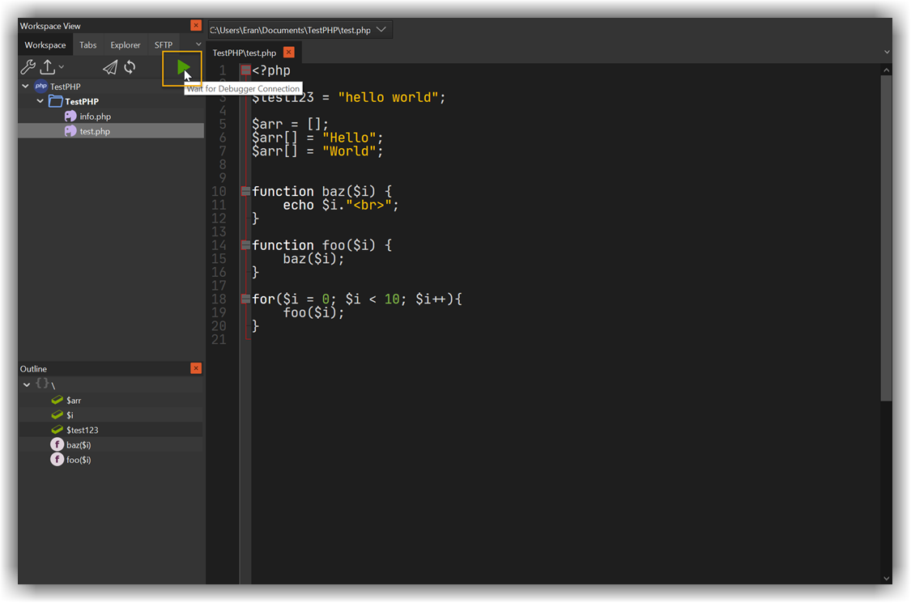
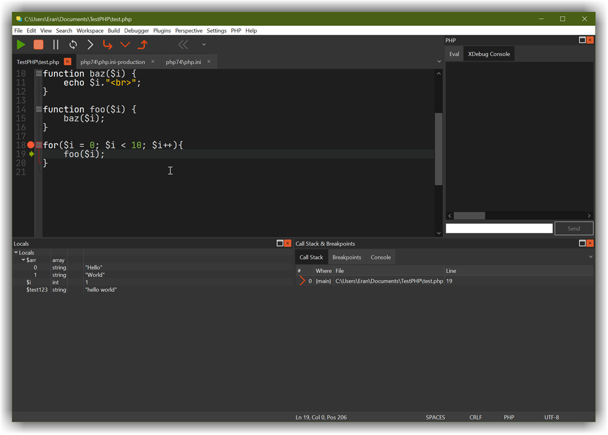

## Quick guide
---

- You will need an [open workspace for this](/workspaces/php/#create-your-first-workspace)
- Now, configure PHP to enable XDebug debugging. From CodeLite menu bar, click on the `PHP` &#8594; `Run XDebug Setup Wizard`
- At the end of the wizard, copy the text and paste it inside your `php.ini` file
- Your `php.ini` should also have a section similar to this:

```ini
[xdebug]
zend_extension=C:\php74\ext\php_xdebug.dll
xdebug.remote_enable=1
xdebug.idekey="codeliteide"
xdebug.remote_host=127.0.0.1
xdebug.remote_port=9000
```

- Next, change directory to the workspace folder (in my case it was: `C:\Users\Eran\Documents\TestPHP` and start PHP debug web server like this

```
cd C:\Users\Eran\Documents\TestPHP
C:\php74\php.exe -S 127.0.0.1:80 -t .
```

- Right click on your project folder and add new PHP file, name it `test.php` with the following content:

```php
<?php

$test123 = "hello world";

$arr = [];
$arr[] = "Hello";
$arr[] = "World";


function baz($i) {
    echo $i."<br>";
}

function foo($i) {
    baz($i);
}

for($i = 0; $i < 10; $i++){
    foo($i);
}
```

- Place a breakpoint at the `for` loop (keyboard shortcut ++f9++)
- Click on the `Wait for debugger to connect` button



- Open a web browser and type in the address bar: `http://127.0.0.1/test.php?XDEBUG_SESSION_START=codeliteide`
- Clicking the `ENTER` button in the browser, the debug session starts



