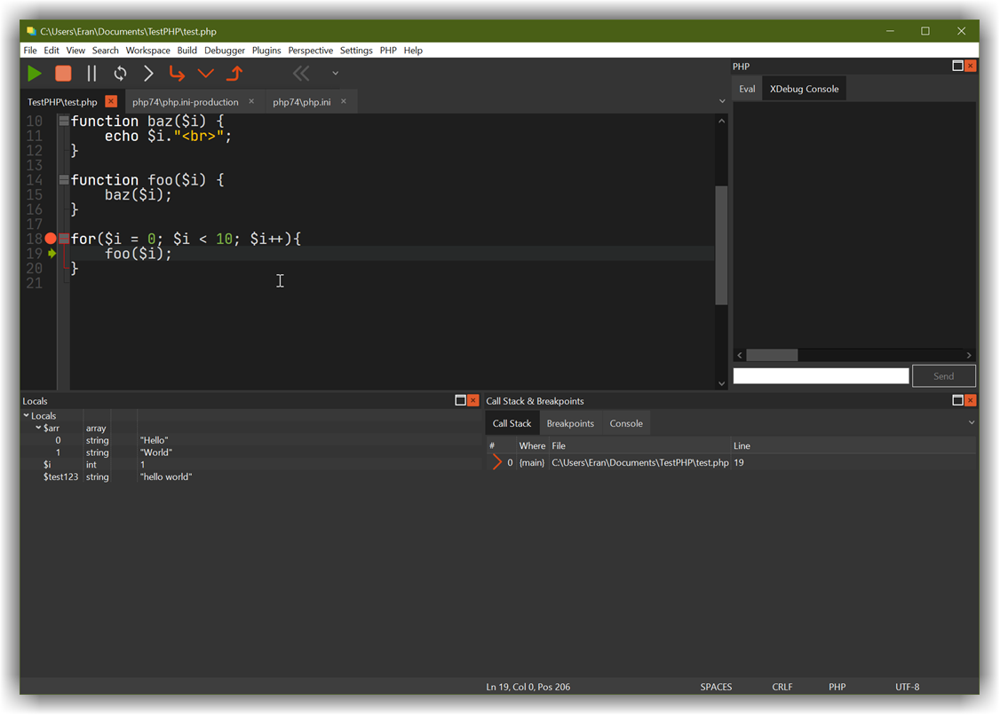

## Quick guide
---

- You will need an open [File System Workspace](/workspaces/file_system/) with `XDebug` selected as its debugger (see [below](#xdebug-with-a-file-system-workspace))
- Now, configure PHP to enable XDebug debugging. From CodeLite menu bar, click on the `PHP` &#8594; `Run XDebug Setup Wizard`
- At the end of the wizard, copy the text and paste it inside your `php.ini` file
- Your `php.ini` should also have a section similar to this:

```ini
[xdebug]
zend_extension=xdebug
xdebug.mode=debug
xdebug.start_with_request=trigger
xdebug.idekey="codeliteide"
xdebug.client_host=127.0.0.1
xdebug.client_port=9003
```

CodeLite supports Xdebug 3 (required by PHP 8). If you still use Xdebug 2, keep your current `php.ini` settings (`xdebug.remote_*`) and set the port in `PHP` &#8594; `XDebug Settings...` to match.

- Next, change directory to the workspace folder (in my case it was: `C:\Users\Eran\Documents\TestPHP` and start PHP debug web server like this

```
cd C:\Users\Eran\Documents\TestPHP
php.exe -S 127.0.0.1:80 -t .
```

- Right click on the workspace folder in the tree view and add a new PHP file, name it `test.php` with the following content:

```php
<?php

$test123 = "hello world";

$arr = [];
$arr[] = "Hello";
$arr[] = "World";


function baz($i) {
    echo $i."<br>";
}

function foo($i) {
    baz($i);
}

for($i = 0; $i < 10; $i++){
    foo($i);
}
```

- Place a breakpoint at the `for` loop (keyboard shortcut ++f9++)
- From the menu bar, click on `PHP` &#8594; `Wait for XDebug to Connect`

- Open a web browser and type in the address bar: `http://127.0.0.1/test.php?XDEBUG_SESSION_START=codeliteide`
- Clicking the `ENTER` button in the browser, the debug session starts



## Xdebug with a File System Workspace
---

XDebug also works with a [File System Workspace](/workspaces/file_system/) on the local machine:

- Open the workspace settings and select `XDebug` as the debugger of the build configuration
- From the menu bar, click on `PHP` &#8594; `XDebug Settings...` to choose how to run the code (command line script or web site), the PHP executable, the include path and the file mapping
- Start the debugger (++f5++). CodeLite asks for the script or URL to debug, and then starts it
- To run the script or open the URL without debugging, use `Build` &#8594; `Run` (++ctrl+f5++). The executable of the build configuration is not used in this case
- To start the session from a web browser instead, click on `PHP` &#8594; `Wait for XDebug to Connect`, and then open the URL with `?XDEBUG_SESSION_START=codeliteide`

The settings and the breakpoints are stored in the file `.codelite/xdebug.json` in the workspace folder.

