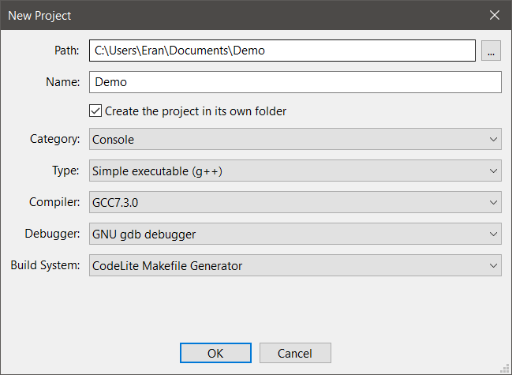
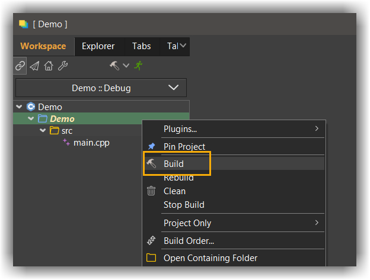

# Getting started

## The setup wizard
---

When you start CodeLite for the first time, the setup wizard is loaded.
The setup wizard allows you configure the following:

- Development profile:
    - Default : everything is enabled
    - C/C++ development: CodeLite is tuned for C/C++ development, i.e. all non C/C++ plugins are disabled
    - Web Development: all non web related plugins are disabled
- Setup compilers: CodeLite will attempt to detect all compilers installed on your computer and configure them
- Customise colours: let you choose a colouring theme ([]you can change it later](settings/colours_and_fonts.md))
- Whitespace and indentation: basic editing configuration

!!! TIP
    You can always launch the setup wizard from main menu bar: `Help` &#8594; `Run the setup wizard`

## `hello world` program
---

1. Create an empty workspace: `File` &#8594; `New` &#8594; `New workspace` and select `C++`
2. On the next dialog, fill the `Workspace path` and `Workspace Name` properties
3. Add a new project to the workspace: `File` &#8594; `New` &#8594; `New project`
4. Fill the dialog similar to the values shown below (your compiler name is probably different than the one shown on the below screenshot)

5. Click the `OK` button
6. CodeLite will generate a sample `main.cpp` file
7. Click ++f7++ to build the project or use the context menu as shown below:

8. Click ++ctrl+f5++ to launch the program

