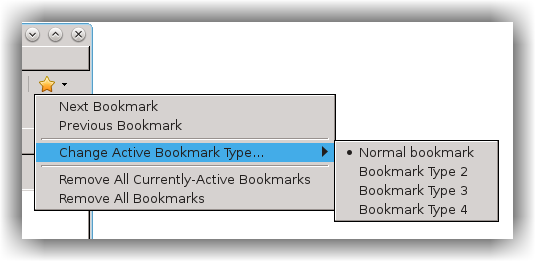
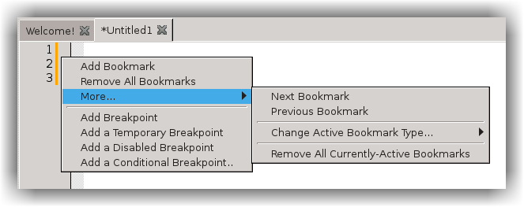
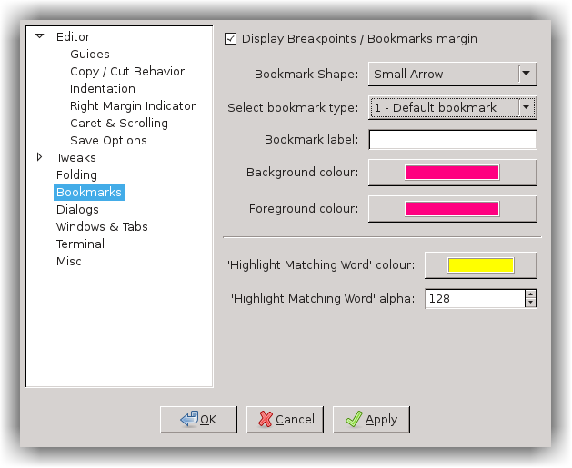

# Bookmarks
---

There are 5 possible bookmark types. This allows you to set different ones for different reasons, without them interfering with each other

## Standard Bookmarks
---

The first 4 bookmark types are for normal use. You create them in the usual way: e.g. from the editor's margin context-menu, 
or by clicking the 'Toggle Bookmark' tool on the toolbar

You can set which type is active from the Bookmarks tool dropdown or (slightly less easily) from the editor's margin context-menu. 
Once a type is active, Next/Previous Bookmark move only between that type; others are ignored. You can also choose to remove either 
all the bookmarks in that editor, or just the active ones. 

## The Find Bookmark
---

The fifth is for 'Find'. It's yellow by default, and they are created either by the QuickFind bar's 'Highlight All Matches' 
tool or by the Find/Replace dialog's 'Bookmark All' button. Its activity can only be changed there, not from the Standard Bookmark menus.
The statusbar displays which bookmark type is currently active. 

## Bookmark Settings
---

Bookmarks can be configured from 'Bookmarks' section of `Settings` > `Global Editor Preferences`
You can change the shape of the marker, which affects all bookmark types. You can also set the colours of each type of bookmark, and optionally give each a more-helpful label ('Find' already comes with one).

When changing colours, note that scintilla reverses the normal the meanings of 'Background' and 'Foreground': the background is the centre of the shape, the foreground the outer rim. 

