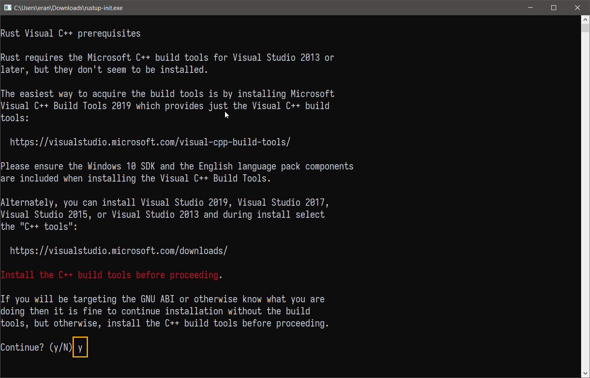
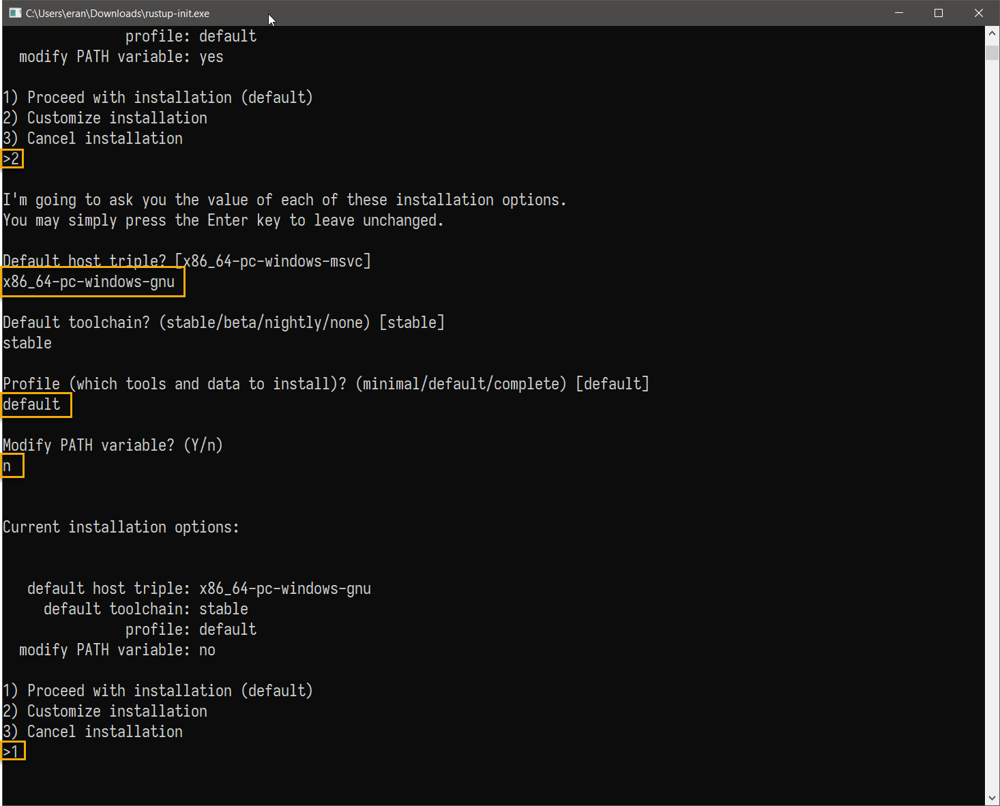

# Install Rust
---

=== "Windows / MSYS2 - (recommended)"
    - Prepare a working [MSYS2 environment][2]
    - Open `MSYS2` terminal and type: `pacman -S mingw-w64-clang-x86_64-rust`

=== "Windows"
    - Download installer for Windows from [here][1]
    - Launch the installer and answer the questions as described below:

    - `Continue (y/N)?` -> answer `yes`
    - Select the option `Customize installation` (option `2`)
    - Set the host triple to `x86_64-pc-windows-gnu`
    - Select the `stable` toolchain
    - Use the `default` profile
    - When asked to modify the `PATH` variable, answer `n`
    - And finally, proceed with the installation (`1`)

    

    

=== "Linux / macOS"
    - Download installer for Windows from [here][1]
    - Accept all the defaults by hitting ++enter++

 [1]: https://rustup.rs/
 [2]: /build/mingw_builds/#prepare-a-working-environment