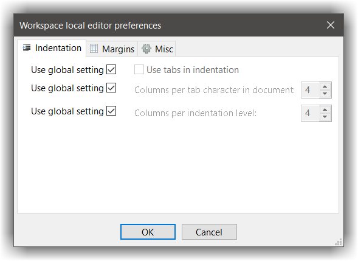

# Local Preferences
---

!!! important
    This section only works for [C++ workspace][1]
    

You can customise much of CodeLite's behaviour from the Settings menu; in particular, Right-click on the worksapace and
select `Workspace Editor Preferences` this lets you make choices about everyday things such as whether line numbers are shown, 
how deep is indentation, what margins are visible. These choices are applied globally, which is usually what you want.

But sometimes this isn't what you want: you might be working on several different projects, which have different ideas about code styles. 
For example, CodeLite prefers an indent of 4, using a spaces but a different project requires which also uses indent of 4 but using spaces; 
tabs are frowned upon or worse. For my project I like an indent of 2 (maybe I have better eyesight, or a smaller screen).

Another reason to want an alternative style is for different types of project. For your code you'll use your preferred style, and probably line
numbers. But what about documentation? Why not have a separate project within your workspace for the app's text docs, and maybe another to store
its web-pages? Line numbers aren't needed for these, and a different combination of the other settings may be more suitable.
As you may have guessed, CodeLite lets you override some of these global settings at a local level. Right-click on the workspace icon in the Workspace View and choose `Workspace Editor Preferences`, or on one of the project icons and choose `Project Editor Preferences`

The current higher-level settings are shown disabled. To alter one, untick the corresponding `Use global setting` checkbox. 
Your workspace-level choices will now be used in all editors belonging to this workspace, unless further overridden by one of its projects. 
Any non-workspace files that are opened will still use the global settings.
To reset any local choices that you no longer want, just tick its `Use global setting` checkbox. The more-global value will then be used again. 

 [1]: /workspaces/default
 