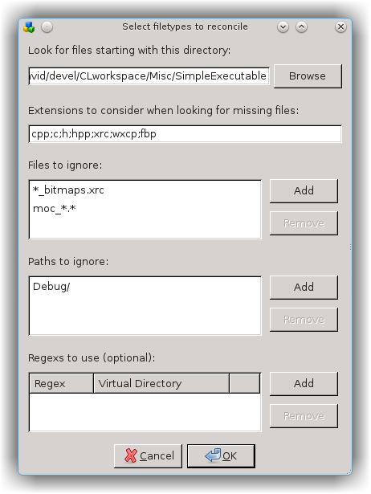
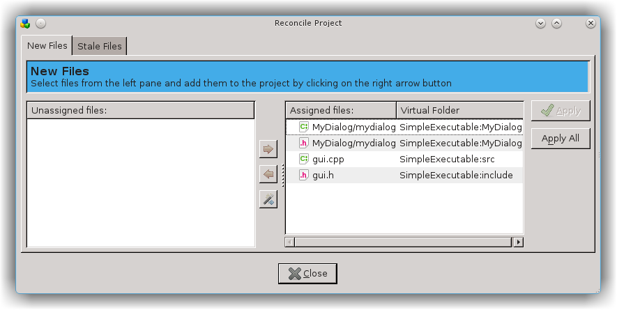
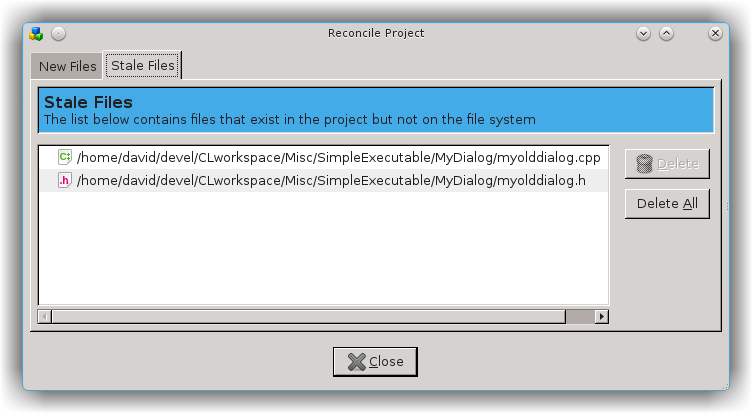
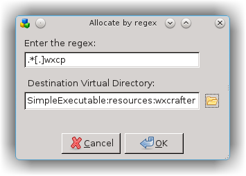

# Sync project with file system
---

!!! important
    This section only works for [C++ workspace][1]

## The Reconcile Project dialog
---

You sometimes may need to get a CodeLite project back in sync with the reality of your filesystem. 
This may happen if you've deleted project files, or if you or a co-worker has created new files outside CodeLite, 
and which not yet added to the project. You can do this by hand, adding or deleting individual files, 
but starting with CodeLite 5.0 it can now be done more easily with the Reconcile Project dialog, 
accessed by Right Click on the `Project` &#8594; `Reconcile project`

First decide which types of file you want to add; sensible defaults are supplied, but any changes will be remembered for
this project. You should also check that the correct path appears in the first field. If your files aren't kept inside the 
workspace directory you should put the correct path here.

The other fields are optional. You can choose to ignore certain files, using standard wildcards if necessary. 
You can ignore particular paths. Finally, if you want certain files to be placed in non-standard Virtual Directories, 
you can provide one or more [regexes][1]

## Allocating New Files
---

The main dialog has two tabs, the first dealing with files unknown to the project. These will initially appear on the left, 
unless they have already been tentatively assigned to Virtual Directories by a [supplied regex][1]

You have two ways of allocating them:

* By hand: Select one or more files, then click the 'Forward arrow' button. A dialog will appear that lets you select the correct destination Virtual Directory (or create a new one). The file(s) will then be moved to the right-hand pane.
* Auto-allocation: If you click the 'Wizard' button, CodeLite will attempt to allocate each item to its best-match Virtual Directory. The algorithm it uses is as follows:
    * It first looks for an immediate child Virtual Directory called, for a source file, 'src' (or 'source' or 'cpp' or 'cc' or 'c'); similarly, for a header file it looks for 'include', 'includes', 'header', 'headers', 'hpp' or 'h'; for an .rc file, 'resource', 'resources' or 'rc'. So a file called foo/bar.cpp will be allocated to foo:src if one exists; foo/bar/baz.h to foo:bar:include.
    * Failing that, it looks for a perfect match e.g. foo/bar/baz.cpp will be allocated to a Virtual Directory called Foo:Bar (note that the match is case-insensitive).
    * If still unallocated, it looks in parent Virtual Directories for a 'src' etc subdir. So e.g. foo/bar/baz.rc will be placed in foo:rc if there's no foo:bar:rc or foo:bar. 

Any allocated files are moved to the right-hand pane and displayed with their target Virtual Directory. Files that couldn't be allocated remain on the left. 

At this stage the project itself has not been altered. To actually add one or more files, either select items in the right-hand 
pane and then click the 'Apply' button; or click 'Apply All'. Remaining files will be ignored when the dialog is closed, and will reappear next time it's run.

This dialog has another feature: you can delete from the filesystem one or more of the unassigned files in the left-hand pane. 
Select the files to be deleted, then right-click and follow the instructions. 

## Stale Files
---

The second tab deals with 'stale' files: ones included in the project, but with a filepath that doesn't exist. Select those 
you want to remove from the project, then click `Delete`; or click `Delete All`

## Using regexes
---

Most of the time, for most projects, your project structure will be sufficiently similar to that of the filesystem that the 
allocation methods just described will be good enough. When it isn't, you can use one or more regular expressions to handle the exceptions.

In the last section of the initial dialog, click the `Add` button. The following dialog will appear: 

Add a regular expression in the first field. This should catch those files that you want to redirect. Then click the `Open` 
icon to select their destination Virtual Directory, and click OK.
Any regexes will be auto-assigned before the main dialog opens, so you will see the affected files in the right-hand pane 
even before you click the `wizard` button. They can then dealt with as described above. 

 [1]: #using-regexes
 