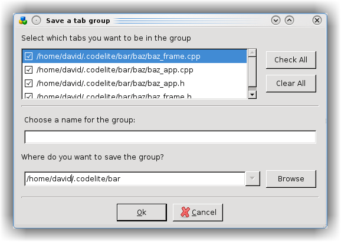
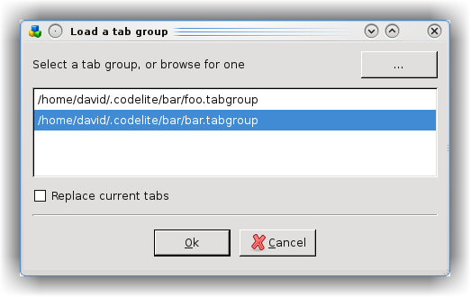

# Tab Groups
---

Your 'HelloWorld' program has become so successful that you've expanded it to take in the whole solar system, with a different 
section for each planet. Congratulations!

However success brings its problems, and one of these is a workspace containing lots of files: far too many to have each 
open in a tab at the same time. CodeLite helps here by reloading the last-used tabs when it restarts, but it would be nice 
to have more: a group of Mars-related tabs, another for Venus...; and be able easily to switch between them.

Well you can. Open all of the tabs you wish to save, and click `File` &#8594; `Save tabs as group`

In the dialog, unselect any that you don't want to store, and choose a name and path. That cluster of tabs will be 
available for reloading in the future, using `File` &#8594; `Load a group of tabs`

Choose a group, or browse for others, and decide whether the tabs should replace any current ones or merge with them 
(not advisable in the case of Mars and Venus). 

