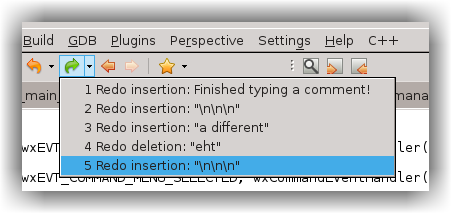
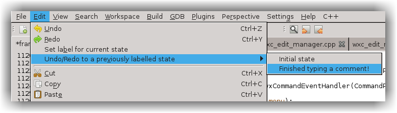

# Undo and Redo
---

As you'd expect, CodeLite allows you to undo any edits you've made to the current page. You can do this via the `Edit` menu, 
the `Undo` and `Redo` toolbar tools and their keyboard shortcuts (++ctrl+z++ and ++ctrl+y++ by default). 
Starting from CodeLite 6.0 the toolbar tools are 'dropdown', so it's possible to undo/redo multiple edits at a time.

Dropdown tools aren't available for the Mac native toolbar.

Here's a trivial example of the Undo dropdown, after typing a few lines: 

## The Undo dropdown menu 
---

and after undoing as shown above, here's the Redo dropdown: 

## The Redo dropdown menu 
---

Be careful when there are lots of alterations on Linux. The gtk menu used for the dropdowns opens near the end of the list, 
not at the top. You'll need to scroll or PageUp to get to the beginning. 

## Labelled States
---

Also since CodeLite 6.0, there's a new entry in the `Edit` menu, Set label for current state, which lets you 'label' the 
current state of a page. That label will then be used in the dropdown menu, and also in another submenu that will appear, Undo/Redo to a previously labelled state. You can see an example in the above screenshots: 'Finished typing a comment!' is such a label.

Why would you want to do this? Suppose you want temporarily to add some logging code. You know you'll want to undo it later, 
but normally that means lots of Undos, or searching through the dropdown list of previous states, until you get to the correct 
place. Or, you decide to add new code but you're not sure it'll work; you'd like to be able easily to revert it. If you start 
by setting a label to the current state, it's a lot easier to locate the correct place to which to revert. And if it's a 
long way back in the history, it's even easier to find using the separate Labelled States submenu: 

