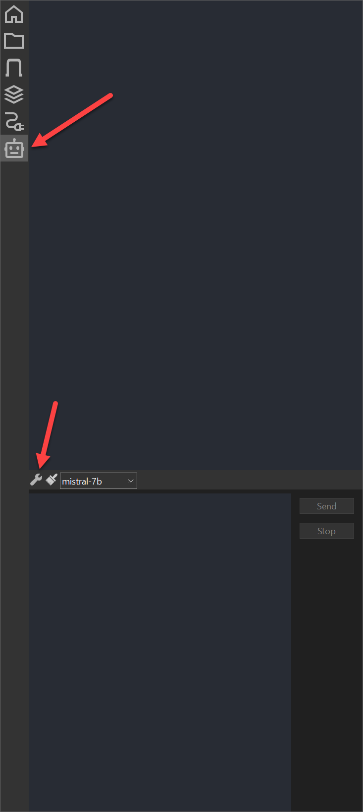
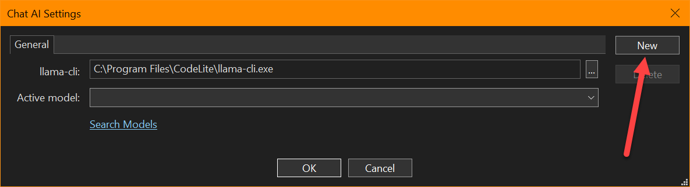
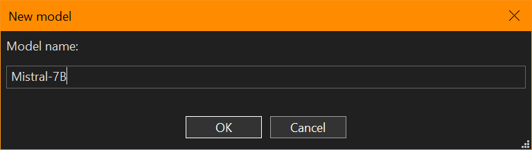
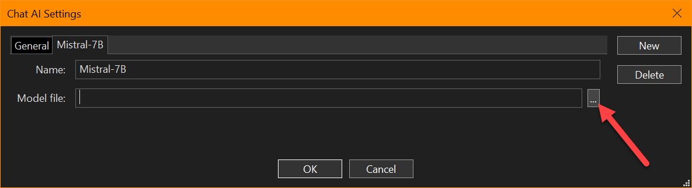
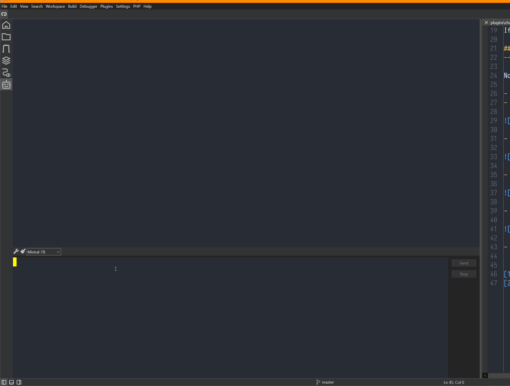

# ChatAI: Your Local AI Helper
---

With the release of CodeLite 18.0.0, CodeLite comes with a new plugin to embeds a chat with a local model of your choice.

## Getting started
---

### Downloading a model
---

Unlike the web models, CodeLite uses a local model, this means that you need to download a model file and select it.

We recommend downloading models from: [Hugging Face][1]

!!! Note
    CodeLite uses `llama.cpp` to communicate with the model, this means that you should only download GGUF model files

If you are not sure what to download, download this model: [Mistral 7B Instruct][2]

### Configuring the model
---

Now that you have downloaded the model file, you will need to create a configuration entry in CodeLite in order to use it.

- Click on the "bot" icon
- In the toolbar, click on the "wrench" button

- In the dialog that is shown, click on the "New" button

- Next, give the model a name, e.g. "Mistral-7B"

- Choose the model file that you downloaded earlier and click the `OK` button

- You can now use the "Prompt" pane to prompt the model:

!!! Warning
    Since the model is running locally, you will need to have enough memory to run the model. Usually, the model pages states
    the amount of memory needed to run each model (a rough estimation)

[1]: https://huggingface.co/
[2]: https://huggingface.co/MaziyarPanahi/Mistral-7B-Instruct-v0.3-GGUF/tree/main
