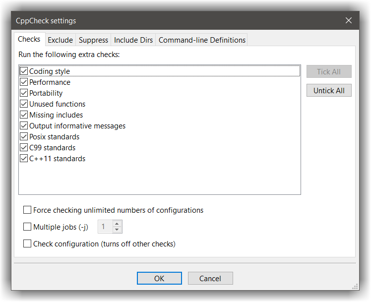
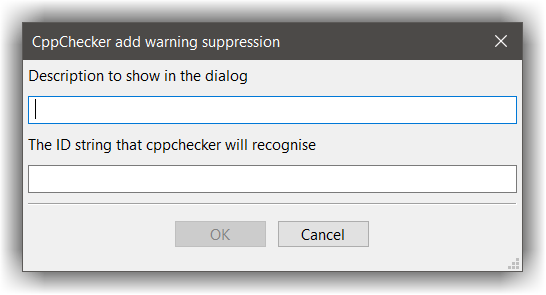

# CppCheck
---

## About
--- 

Cppcheck does static analysis of C/C++ code. It checks for: memory leaks, mismatching allocation-deallocation, buffer overrun, and many more. 
The goal is `0%` false positives Read more [here][1]

## How does it work?
---

From within codelite, you can start Cppcheck by right-clicking any of:

- the file currently edited; only this file will be checked.
- a file in the 'File Explorer' tree; only this file will be checked.
- a folder in the 'File Explorer' tree; only this folder's contents will be checked.
- a Project icon in the workspace view; just this project's files will be checked.
- the Workspace icon in the workspace view; the whole workspace will be checked. 

Then select `Cppcheck` &#8594;  `Run Cppcheck`.

This will bring up the 'Cppcheck' progress report tab (part of the `Output` view). 

## Settings
---

The 'Cppcheck' settings dialog is accessible in any of the above ways, and also from the Plugins menu, `Cppcheck` &#8594; `Settings`. This dialog has 3 or 4 tabs:

- The `Checks` tab
- The `Exclude files` tab
- The `Suppress` tab
- The `Include dirs` tab
- The `Definitions` tab (not always shown)

### Checks tab

The Checks tab allows the user to set or reset various Cppcheck options. 

### Exclude files tab

Add here any files to be excluded during the check. This saves time by stopping Cppcheck analysing uninteresting files

### Suppress tab

Cppcheck often produces large numbers of particular types of warnings e.g. `Member variable 'foo' is not initialized in the constructor`. 
These make it difficult to see other, perhaps more important, results. Here you can suppress one or more of these warnings. 
A few such types are preloaded; tick the ones that you want to be active. Click the `Add` button to add extra ones.

The `Add Suppression` dialog has two fields to fill. The first is just a user-visible description; as you're the user, you can enter whatever you like ;) 
The second is harder. It must contain the ID string that Cppcheck will recognise as matching that warning; examples are "variableHidingEnum" and "variableScope". 
Unfortunately there seems to be no easy way to obtain these strings; I found these ones by grepping the Cppcheck source.

If, when you run Cppcheck, one of the suppressions isn't matched (there weren't any of that warning type, so the suppression wasn't needed) 
you'll get a worrying-looking message e.g. `information: Unmatched suppression: variableScope`

### Command-line Definitions

This lets you pass definitions or undefines to Cppcheck that would normally be passed as command-line options when running Cppcheck direct. This is explained (a bit) in section 3 of the [Cppcheck manual][2]

Suppose you wanted to check code where FOO was defined, or where its value was defined as 2. Your code also contains branches where FOO is undefined, or where its value != 2. Normally Cppcheck would test all the branches (or 'configurations' in Cppcheck parlance). That might result in lots of irrelevant errors and warnings. Adding a define of FOO=2 will tell Cppcheck to ignore other branches. It will be passed to Cppcheck as -DFOO=2, so don't supply the -D yourself.

Though the syntax is the same, these definitions and undefines are not anything to do with compiling or running your program. They are passed only to Cppcheck.

Similarly you can add Undefines, which will be passed as e.g. -UBAR. This tells Cppcheck specifically to ignore branches where BAR is defined.

Note that these Definitions are specific to a particular project, which is almost certainly what you'd want. Other projects in that workspace or other workspaces, and stand-alone files, are unlikely to care whether BAR is defined. This has two consequences:

- The Definitions tab is only shown when the Settings dialog is opened from a Workspace-pane project context-menu.
- Any definitions are only applied to Cppcheck when it's run from a Workspace-pane project context-menu. 

Note also that all of this is relevant mostly when Coding style is checked in the Checks tab, as otherwise any warnings will probably not be emitted. 
Also, it's supposed not to work when the `Force checking unlimited numbers of configurations` box is ticked, though at least for the current version it still does. 

 [1]: https://sourceforge.net/apps/mediawiki/cppcheck/index.php?title=Main_Page
 [2]: http://cppcheck.sourceforge.net/manual.pdf