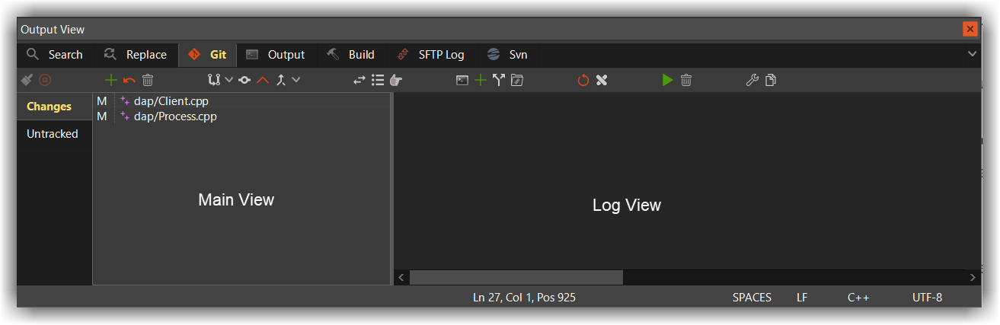

# Git Plugin

## Preface
---

This document covers the basic usage of the git plugin within CodeLite. It's not intended to be a replacement for a good git tutorial; 
you still need to know what git is and how to use it before working with the plugin.

## Prerequisites
---

For the plugin to work, git needs to be installed:

OS | How to install?
-------|---------
Ubuntu / Debian | `sudo apt-get install git`
macOS | `brew install git`
Windows | [Download git from here][1]

## Basic functionality
---

When loading a workspace into CodeLite, CodeLite notifies the git plugin that a workspace is loaded; the plugin will try to set its root folder to the workspace path. 
By default the path tracked by the git plugin is the path to the workspace file, but this can be modified by the user from the `Git` tab in CodeLite's `Output View`

The git plugin will refresh its view after every Save operation; 
i.e. when a file is saved, the git command line `git status -s` is executed and the results displayed in the tree view. 

## Commands supported by the git plugin
---

The following commands are supported by the git plugin (either from the toolbar at the top of the git view or from the `Plugins` &#8594;  `Git` menu): 

- Git clone - clone an existing repository
- Apply patch
- Add file - add an untracked file to the repository, or 'stage' an altered file
- Reset file - revert all local changes done to a file
- Refresh view - equal to running the command `git status -s`
- Reset repository - this is the equivalent of running the `git reset --hard` command
- Pull remote changes - pull remote changes to your local repository and (optionally) perform a rebase
- Commit local changes - commit local changes to your local git repo
- Push local changes - push your committed local changes to the remote repo
- Create local branch
- Switch to local branch
- Show current diff - displays a list of modified files in our repository and view the changes in the diff view `git diff`
- Browse commit history - opens up a dialog with all the commit history. In addition you can right click a commit and revert it

 [1]: https://gitforwindows.org/
