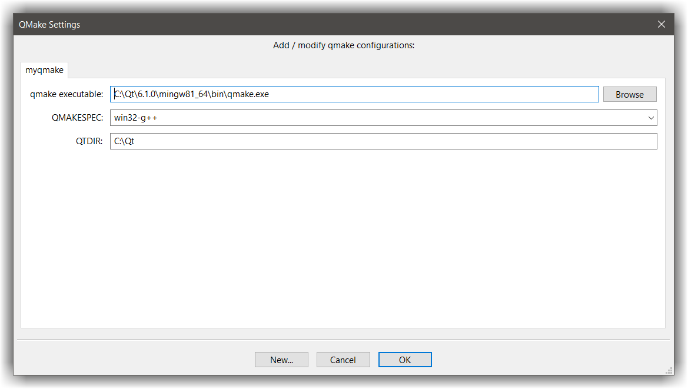

# QMake plugin
---

!!! WARNING
    This plugin is deprecated. You should consider using `CMake` instead of `QMake`

The Qmake plugin is a codelite plugin which overrides the default build system of CodeLite, and uses Qt's qmake tool.
It does that by producing a `.pro` file (qmake's project file) from a CodeLite project file (.project) and executing `qmake` on the generated `.pro` file
Using this plugin, you can quickly create Qt projects using CodeLite


## Defining new qmake
---

- From the menu bar, open the qmake settings dialog (`Plugins` &#8594; `Qmake` &#8594; `Settings ...`) , click on the `New` button, give it a name (e.g. MyQmake) and click `OK`
- You should now have a dialog similar to the one below
- In the `qmake executable` field, enter the full path to your qmake executable
- Once the above field is populated properly, you should have a list of options in the `QMAKESPEC` field. Choose the settings that suit you best (on Windows using MinGW you should choose `win32-g++`, while on Linux, choose `linux-g++`).
- `QTDIR` should point to your Qt base installation directory



## Creating a qmake based project
---

Once you have set up a qmake setting to work with, you are now ready to create your first qmake based project.

- Open the `New Qmake project` dialog from the menu (`Plugins` &#8594; `Qmake` &#8594; `New qmake based project`)
- Fill the fields with the appropriate values and click `OK`
- You should get an empty workspace with a single project with the name you provided in the previous step
- Open the project settings (right click on the project icon and select `Settings...`)
- In the `General` page, choose the compiler to use
- Click `OK` to dismiss the dialog
- Right click on the `src` folder and add a `main.cpp` file with the following content:

```c++
 #include <QString>

 int main(int argc, char **argv)
 {
    QString str;
    str = "Hello world from QT";
    printf("%s\n", str.toLocal8Bit().constData());
    return 0;
 }
```

- Right click on the project and select `Plugins` &#8594; `Run qmake`
- Click ++f7++ to build as usual

## QMake project settings
---

For many people the above steps are sufficient to work with Qt, but there are cases when you need to add some tweaks to the .pro file.
This is done from the project settings: right click on the project, and select `settings`

The `Project Settings` dialog pops up, but now it has an additional tab, named `Qmake`

- Check the `This project uses qmake` checkbox to allow the qmake plugin to override the default build system; unchecking it tells CodeLite to use the default build system for the project
- The `qmake execution line` is currently not in use, and should be ignored
- In the free text area, you may add any `.pro` syntax code that will be appended to the generated `.pro` file

For example, if you want to build a project without the QtGui module, you need to exclude the gui value with the `-=` operator; the following line will result in a minimal Qt project being built:

```
 QT -= gui # Only the core module is used.
```
