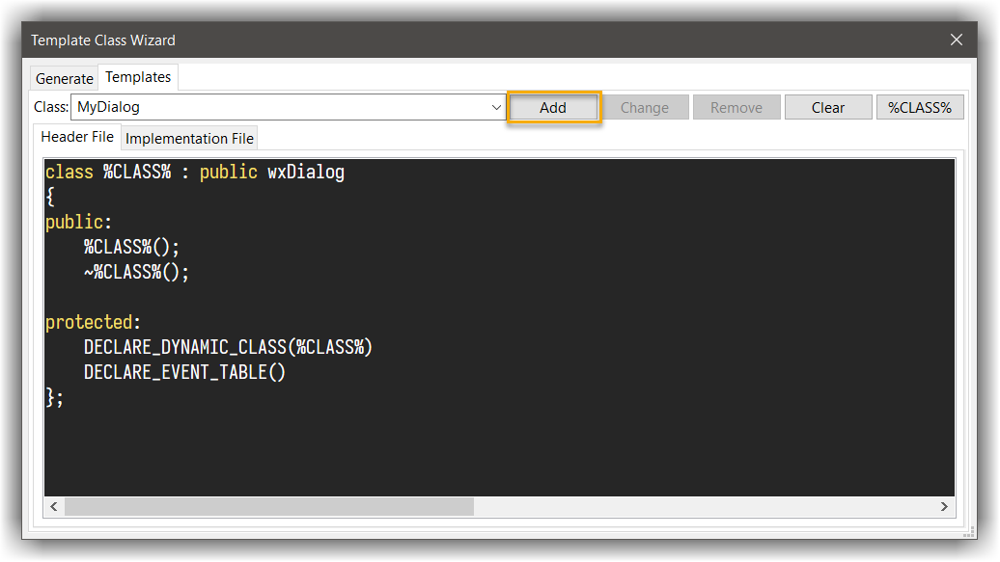

## The SnipWiz Plugin
---

The SnipWiz plugin was generously contributed by **Frank Lichtner**. It has two parts: a Snippet Wizard and a Template Class Wizard. 

### Snippet Wizard
---

This provides a way of inserting commonly-used code snippets direct into your code. Several are provided by default, but you can amend these and add others of your choice. 
You can insert a snippet into your code by right-clicking and choosing SnipWiz from the context menu. 

There are two Placeholder symbols available:

- `$` will be replaced by the selection, if any.
- `@` sets the position where you want the caret to be after the snippet has been inserted.

For example, one snippet is: 

```
for ($ = 0; $ < @; $++)
```

Let's say you had selected the word `counter` This will expand to:

```
for (counter = 0; counter < |; counter++)
```

where the `|` symbol represents the caret position (imagine it blinking), in the right place for you to add the maximum-count figure. 

 
The Edit Snippets dialog is accessed from `Plugins` &#8594; `SnipWiz` &#8594; `Settings`. On its left is a list of menu entries for known snippets. 
On the right the selected entry is displayed, with the code it inserts. The Change and Remove buttons do the obvious things to the current selection. 
To add a new item, amend the selection (both the menu item and the code), then click `Add`. 

For example, to add a snippet that surrounds a string with `wxT("` and `")`, amend one of the similar ones. 
You might change the menu entry from: `wxT("` to `wxT("$")` and the code from: `wxT("@")` to `wxT("$")` Click `Add` to add the new entry. 
Now if you highlight the word `foo` in the editor, and select `wxT("$")` from the context menu, you should now see `wxT("foo")`

If you press the ++ctrl++ key while clicking on the snippet menu, the snippet is not inserted at the current caret position, 
but instead is copied to the clipboard and also to an internal buffer. You can do the insertion elsewhere, perhaps repeatdly, by pasting in the usual way (e.g. ++ctrl+v++), 
or from that buffer (via the context menu). Note however that the original text selection is retained: selecting `wxT("$")` from the 
context menu while ++ctrl++ is being pressed and foo selected will copy `wxT("foo")` to the clipboard; 
and so multiple pastes will insert multiple `wxT("foo")`s, irrespective of what is subsequently hightlit. 

!!! TIP
    If you have a multi-line snippet, you should paste from the internal buffer, since this will retain the correct indentation. 

### Template Class Wizard
---

`Plugins` &#8594; `SnipWiz` &#8594; `Template` class runs the Template Class dialog. This lets you create templates of classes to reuse. 
For example, I often derive from `wxDialog`; here's a template that expedites this:

#### Create a new template for `wxDialog` subclasses

- Select the `Templates` tab in the dialog and place the below content:

In the `Header File` tab:

```c++
class %CLASS% : public wxDialog
{
public:
    %CLASS%();
    ~%CLASS%();

protected:
    DECLARE_DYNAMIC_CLASS(%CLASS%)
    DECLARE_EVENT_TABLE()
};
```

While the `Implementation File` tab content is:

```c++
IMPLEMENT_DYNAMIC_CLASS(%CLASS%, wxDialog)

%CLASS%::%CLASS%()
{
}

%CLASS%::~%CLASS%()
{
}

BEGIN_EVENT_TABLE(%CLASS%, wxDialog)
END_EVENT_TABLE()
```

!!! Info
    The keyword `%CLASS%` stands for the class name. When the template is used, all occurrences of it will be replaced with the actual class name. 

You should now have a dialog with the following content:
- Click `Add` - this will save your new template



#### Using the template

- Switch to the `Generate` tab
- Under the `Class` section select the template (in our case `MyDialog`)
- Give a name to your class (this will replace the `%CLASS%` place holder)
- Under the Files section, set the file name (header and implementation), path and (optinally) a project tree folder
- Click `Generate`

You should now have 2 new files generated: header and implementation files with the class definition

