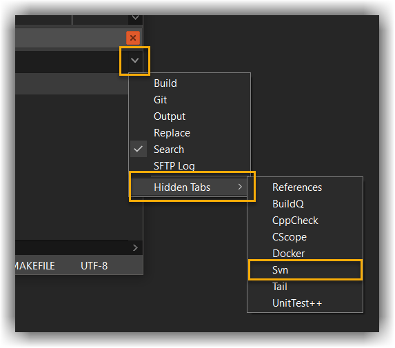
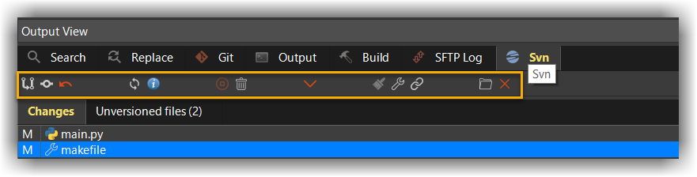
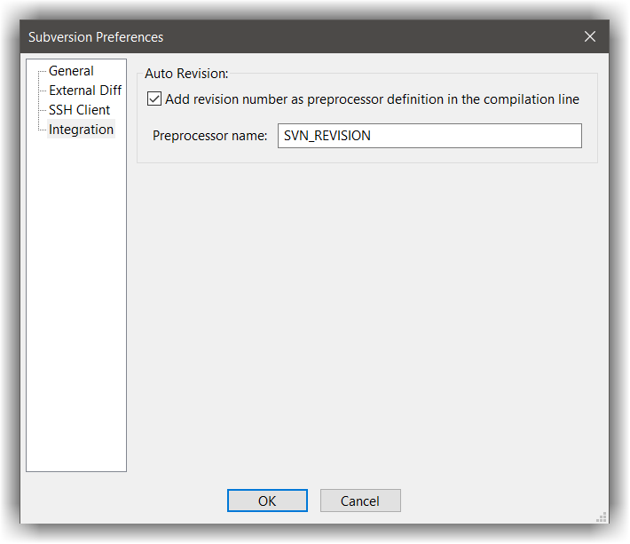
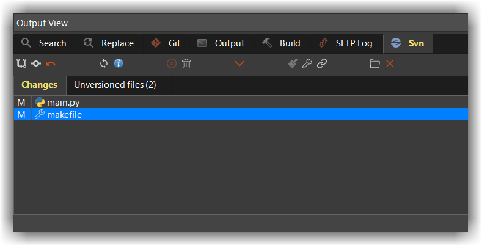

# Subversion
---

## General
---

The `Svn` tab is located in the Output View (usually placed at the bottom). If you can't see it, then remove it from the Hidden tabs: Click on the little arrow button (on the top right) and select `Hidden tabs`
The svn view will display the output of the command `svn status --xml` in a list view. The root folder is selected based on the workspace location, however you can select a different location by clicking on the folder icon at the top of the SVN view tab



The `Svn` tab offers a toolbar with various buttons on it to perform the most common `svn` commands such as:

- `commit`
- `update`
- `revert`
- `diff`
- `apply patch`
- `create patch`



## Installation
---

In order to work with the Subversion plugin, you will need to install the svn command line tool for your OS. It is recommended to use svn client `1.6.X` and up, 
since some of the switches used by codelite were introduced in version `1.6` (although older versions will work as well). 

- Windows - download the latest binary [from here][1]
- Linux:
    - Ubuntu: `sudo apt-get install subversion`
    - Fedora: `yum install subversion` 
- macOS - it should be installed by default or with the XCode installation

## Integrating build number
---

The latest Subversion plugin offers a simple but very useful option to add a preprocessor definition into your compilation line which will contain the current revision number as a string.
To enable the build integration, open the svn settings dialog and select the **Integration** tab and enable that page: 



## Setting a diff viewer
---
 
By default, CodeLite implements its own diff viewer which is enough for most tasks.
You can double click any file in the `Changes` tab to open the diff viewer.



If the built-in diff viewer is not good enough, you can integrate an external diff viewer.

To integrate an external diff viewer, open the Subversion settings dialog (either from subversion toolbar, or from the `Plugins` &#8594; `Subversion2` &#8594; `Subversion Options menu`) and select `External Diff` tab
Check the `Use external diff viewer` checkbox, and select your tool of choice

### WinMerge

One of the most popular tools around (under Windows at least) is the open source tool [WinMerge][2]
Follow these steps to integrate WinMerge with CodeLite subversion plugin:

- Create a small batch script named `winmergesvn.bat` with the following content, and save it on your disk 

```batch
 start "WinMerge" /B /WAIT "C:\Program Files\WinMerge\WinMergeU.exe" /e /ub /dl %3 /dr %5 %6 %7
```

- Open the subversion settings dialog: `Plugins` &#8594; `Subversion2` &#8594; `Subversion Options menu` &#8594; `External Diff`
- Select this batch script as your diff tool

### Araxis Merge

Another great tool (my favourite), however it is not a free tool, but very powerful. To make Araxis your default diff viewer: 

- Open the subversion settings dialog: `Plugins` &#8594; `Subversion2` &#8594; `Subversion Options menu` &#8594; `External Diff`
- Select executable named `AraxisSVNDiff.exe` as your diff tool 

### Kdiff3

Similar to Araxis:

- Open the subversion settings dialog: `Plugins` &#8594; `Subversion2` &#8594; `Subversion Options menu` &#8594; `External Diff`
- Set `kdiff3` as your diff tool 

 [1]: https://www.sliksvn.com/en/download
 [2]: https://winmerge.org/
 
 