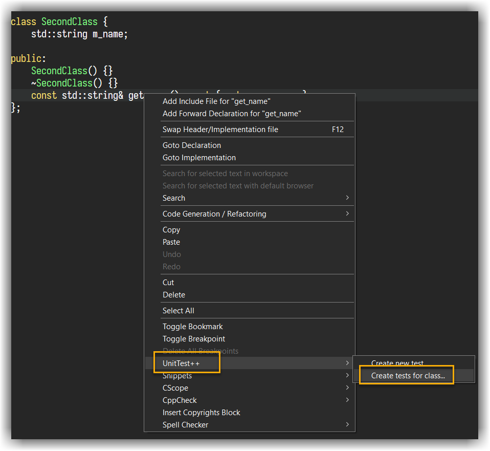
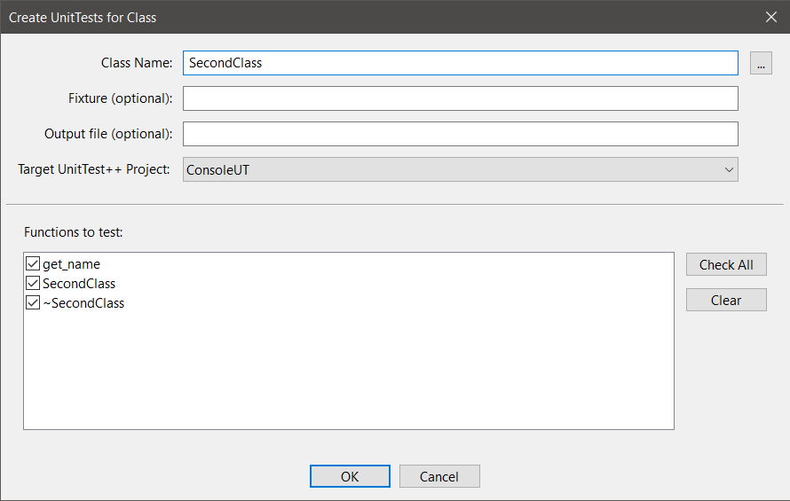
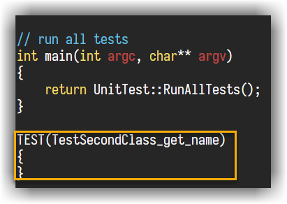
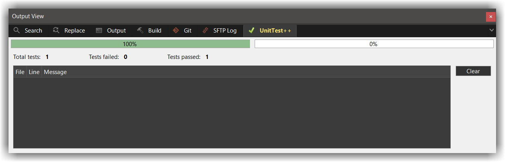
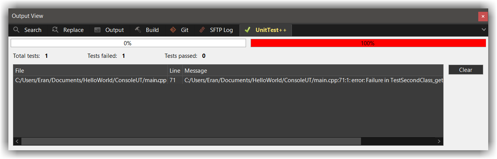

# UnitTest++
---

!!! warning
    The `UnitTest++` project is [soon to be archived][1], I do not recommend new users to use it for
    their projects
    
## Getting started
---

- Get the sources from GitHub: `git clone https://github.com/unittest-cpp/unittest-cpp`
- Build it using `CMake`:

```bash
 cd unittest-cpp
 mkdir build-release
 cd build-release
 cmake -DCMAKE_BUILD_TYPE=Release ..
 make -j4
 sudo make install
```

## Creating a new UniTest++ project
---

!!! important
    This plugins only work with the [default C++ workspace][2]
    
- From the menu, go to `Workspace` &#8594; `New Project` and select project category to `UnitTest++`
- Fill in the project details and click `OK`. 
 
A new project with a new file is created with a single `main.cpp` file. This file is heavily documented with examples on how manually to add tests

- From `Project Settings` &#8594; `Compiler` &#8594; `Include Paths` add the path to where `UnitTest++` installed its headers (on Linux, it's installed under `/usr/local/include`)
- From `Project Settings` &#8594; `Linker` &#8594; `Library search paths` add the path to `libUnitTest++.a` (on Linux, it's installed under `/usr/local/lib/`) 
- From `Project Settings` &#8594; `Linker` &#8594; `Libraries`, make sure it includes `libUnitTest++.a`
- Close Project Settings, then make sure the project compiles and links correctly


## Adding new tests
---

You are now ready to add tests to your classes. To do so: 

- Right-click on an editor within CodeLite.
- In the context menu that appears, select `UnitTest++` -> `Create tests for class`
- In the resulting dialog, type the name of the class that you want to test, or click on the `[...]` button to get a list of classes.
- Select the target UnitTest project (CodeLite will place the tests in this project)
- Check the functions you want to test
- Click `OK`

You should now see a new code added to the `main.cpp` file for every function you selected:







For me, compiling the above example produces this:

```batch
C:/compilers/mingw64/bin/mingw32-make.exe -j24 SHELL=cmd.exe -e -f  Makefile
"----------Building project:[ ConsoleUT - Debug ]----------"
mingw32-make.exe[1]: Entering directory 'C:/Users/Eran/Documents/HelloWorld/ConsoleUT'
C:/compilers/mingw64/bin/g++.exe  -c  "C:/Users/Eran/Documents/HelloWorld/ConsoleUT/main.cpp" -g  -o ../build-Debug/ConsoleUT/main.cpp.o -I. -I. -IC:\src\unittest-cpp
C:/compilers/mingw64/bin/g++.exe -o ..\build-Debug\bin\ConsoleUT @../build-Debug/ConsoleUT/ObjectsList.txt -L. -LC:\src\unittest-cpp/build-release  -lUnitTest++
mingw32-make.exe[1]: Leaving directory 'C:/Users/Eran/Documents/HelloWorld/ConsoleUT'
====0 errors, 0 warnings====
```

Running it shows this:



The above code has no errors, but if I had error in the code the report would have provide the line + description.
To demonstrate that, modify the `TestSecondClass_get_name` function into this:

```c++
TEST(TestSecondClass_get_name)
{
    std::string s = "hello";
    CHECK_EQUAL(s, "world"); // boom!
}
```



!!! Tip
    Double clicking the error entry in the view will take you directly to the problematic line

 [1]: https://github.com/unittest-cpp/unittest-cpp
 [2]: /workspaces/default/
