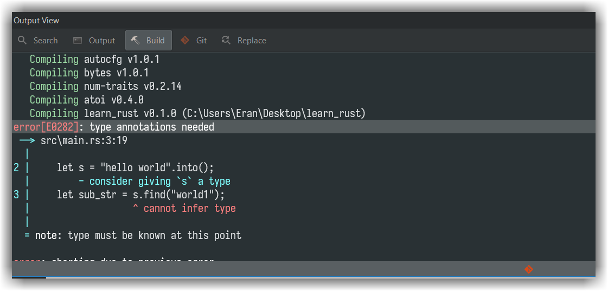
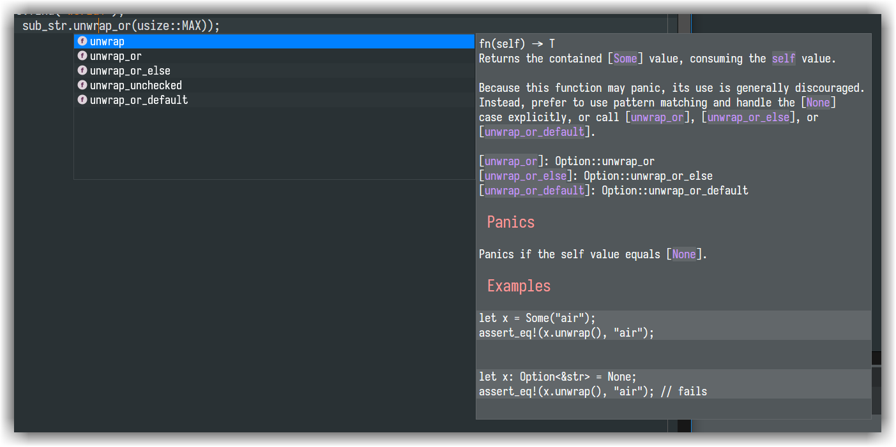

# CodeLite 16.0.0
---

## Downloads
---

As always, all downloads are available through our [download page][1]

## Bug fixes
---

- Fixed: externally modified files are not reloaded
- Remove redundant file system scan
- Fixed: always pass `RootURI` when sending `Initialize` request to the LSP server, even if the user did not provide one
- Fixed: JSON encoding issue
- Fixed: `codelite-terminal` does not apply environment variables when generating `compile_flags.txt` file required by `clangd`
- Fixed: Linux: Move tab right / left with the keyboard does not work
- Fixed: file system workspace: in some cases, system scan is not working as intended and only scans the top level
- Fixed: code formatter regression which caused CodeLite to override the user's settings
- Fixed: GTK: right click on tab causes a weird behavior of selecting random file
- Fixed: Implement All Un-Implemented Functions not working when header and source are not placed in the same directory
- Fixed: wxCrafter: "Insert into new Sizer" should not be visible for wxAuiManager (by *rlbxku1r*)
- Fixed: CodeLite Makefile Generator - UNIX: Windows resource files are not compiled
- Fixed: "Closed other tabs" -> send "close event" for every closed tab
- fixed: PHP workspace: allow user to include the workspace or project folder when selecting `Find In Folder` from the context menu
- fixed: PHP workspace: make it multiple selection
- Fixed: make sure that the editor folder exists before writing
- Fixed: C++ workspace: post/pre build events: ignore empty commands
- Fixed: Feature request: include file extensions for [Drupal projects][2]
- Fixed: Fix Output View multi-byte text handling (*rlbxku1r*)
- Fixed: PHP settings: post parse-workspace event only when a PHP workspace is opened
- Fixed: spell checker: when calling "Check" on a file, do not uncheck the option of the 'continuous checking'
- Fixed: keyboard shortcuts are now working once again in wxCrafter
- Fixed: word completion is broken if a word contains letters with diacritics
- Fixed: avoid restarting any non C++ Language Server when the build process ends
- Fixed: crash when clicking on the "Link Editor" and no active editor is opened
- Fixed: colours and fonts dialog: changing the global theme now enables the `apply` button
- Fixed: Syntax highlight Dialog: when importing a theme, print its name in the completion dialog
- Fixed: use custom GTK code to get the parent bg colour
- Fixed: GTK assertions
- wxCrafter: Fix inconsistent style of option array strings. These strings are now properly wrapped according to the 'Generate Translatable Strings' setting (*rlbxku1r*)
- wxCrafter: Fix invalid string literal in auto-generated `wxHtmlWindow` code (*rlbxku1r*)
- wxCrafter: Add missing translations (*rlbxku1r*)
- Fixed: `codelite-terminal` should now start on `macOS`
- Fixed: `Quick Add Next` now ensures that if the match is in a hidden line (aka `folded`), it unfold it. fixes: https://github.com/eranif/codelite/issues/2748
- Git plugin: operations on the tree view now uses the correct repository path
- Fixed: https://github.com/eranif/codelite/issues/2763 - Goto Declaration/Implementation doesn't work (well) with tabs
- fixed: on linux, on certain window managers, the tooltip size calculation is smaller than the size required for actually drawing it
- MSW: don't allow dark mode for text controls
- Removed the non maintained Notebook style: `TRAPEZOID`
- Fixed: [Wrap with brackets option not working][fixes: https://github.com/eranif/codelite/issues/2822]
- Find Replace Bar: fixed issue with no Latin charcters
- Fixed: code completion tooltip generated by the CTags code completion engine are not compatible with markdown syntax
- Fixed: function hover tip should not be rejected by the file system workspace (*rlbxku1r*)
- Fixed: changing the zoom in one editor, applies it to other editors as well
- CodeLiteDiff fixes
- Code Formatter: various fixes to `clang-format`
- Fixed: `Close other tabs` context menu entry, does not attempt the modified `this` tab
- Fixed navigation bar persistency issue (*rlbxku1r*)
- Fixed: `Remoty`: when `Remoty` is enabled, typing in the `Remote path` field manually, causes CodeLite to crash
- Fixed: Create New C++ Project: do not prompt the user to switch to `CodeLite Makefile Generator - UNIX` when using GCC from the **MinGW** MSYS repository
- Fixed: navigation bar commit message does not update with when changing lines
- Fixed: Syntax Highlight: clicking on the `Restore Defaults` button, will now restore the previous font + selected theme
- Fixed: GNU make & bash builder: Fix error with parent directory name containing spaces (*rlbxku1r*)
- Fixed: CodeFormatter: `Export .clang-format file` points to the workspace directory by default
- Fixed: Debugger: Fix a regression that the setting `Use CTRL key to evaluate expressions under the cursor` doesn't remember its value
- Fixed: Project Settings: Don't try to save or clone an unnamed compiler
- Fix Search & Replace for UTF-8 string
- Fixed: GTK: at times, right clicking inside an editor might trigger the tab control context menu this could happen when right clicking near the top edge of the editor.
- Fixed: GTK: output view/workspace view: choosing "hide" or "detach" from the tab context menu for a non active tab, would perform the selected action on the active tab
- Fixed: [File System Workspace: Reload Workspace does not restore session][8]
- Fixed: [Regression: Find Bar: unable to navigate using the `TAB` button][9]
- Fixed: Regression: Language Server Plugin: Find Symbol does not highlight the match

## Improvements
---

- Fixed: be more tolerant for language server implementations that do not implement the protocol as is (e.g. rust)
- Added `Rust` syntax highlight
- LSP: support completion item's doc implemented inside `MarkupContent`
- Added **new** `Rust` plugin:
    - Debugger support via `rust-gdb`
    - Project management
    - Code completion via the Language Server Plugin using the `rls` server or the `rust-analyzer` LSP
    - Build output is clickable and allows user to quickly open problematic source files
- Git Commit List dialog: layout changes. Make the diff window occupy half of the dialog
- Windows / macOS: visual updates to the notebook control
- clToolBar: honour the `wxTB_NODIVIDER` style flag
- use a more sensible colours for highligthing text in the various tree / list controls
- Implemented a custom Menu Bar
- Better dark mode support on windows
- General performance & stability fixes
- Added new Remote plugin which allows user to load a remote "File System Workspace" over SSH
- Task view removed. It is now part of the Find In Files dialog
- Colours and fonts dialog: updating the text selection colours is now done for all the languages supported for the currently active theme
- Windows: use codelite-exec to launch program when the 'pause when execution ends' flag is checked in the project settings. This also prints the program exit code
- **Remoty plugin**: use the newly added `codelite-remote` interface which allows using various plugin on a remote machines:
    - `Git`
    - `find in files`
    - `Language Server Plugin` over SSH
    - Diff plugin
- UI updates
- Added new tab control style: `FIREFOX` (screenshot below)

- Build tab output rewritten: it now honours the terminal colours

- Git plugin log view re-written and it now uses the same control as the build output, which honours the terminal colours
- Project Settings: Improve dirty settings detection (*rlbxku1r*)
- Project Settings: Use `append` by default for PCH flags option (*rlbxku1r*)
- Various fixes for building CodeLite using MinGW + CMake (Tim Stahlhut)
- Windows and macOS are now built against latest wxWidgets 3.1.6
- `clangd` + `clang-format` that comes with CodeLite for macOS and Windows are now using version `12.0.0`
- File System Workspace: support multi-line commands in the build pages
- When using the file system workspace, export a special enviroment variable `CXX_INCLUDE_PATHS` this variable contains a list of compiler search paths for header files, separated by `;` is useful when using `CMake` + `MinGW` + `file system workspace` under windows, where the `CMAKE_EXPORTS_COMPILE_COMMANDS` does not include the compiler search paths, which breaks `clangd` code completion
- GDB-MI output parser re-written to support custom file paths with unusual characters
- VIM:Add some new commands (`~`, `o`, `O`) (mx)
- When importing themes with true black colour as their background colour, soften the it a bit
- git plugin: better support for remote repository where the workspace is not set in the root folder of the workspace
- change the location of CodeLite temp folder into `/tmp/codelite/PID`. This should reduce the spam under the `/tmp` folder
- Support drawing multiline text in the clTreeCtrl
- Code completion entry tooltip: CodeLite now supports Markdown rendering
- New project wizard: more fixes to avoid problems when using `MSYS2` compiler on Windows (*rlbxku1r*)
- wxCrafter: Fix wrong tree order on the first sibling widget duplication (*rlbxku1r*)
- LSP `Find Symbol`: Make text selection `UTF-8` aware
- Multiple tooltip Markdown renderer fixes (*rlbxku1r*)

- Colouring of semantic tokens is now done by the Language Server plugin
- Updated the default themes that comes with CodeLite
- C++ context menu: `Find Declaration` & `Find Implementation` entries are now replaced withe single, intelligent `Find Symbol` entry
- Use native checbox drawings on Windows for clTreeCtrl/clDataListCtrl
- [Implemented: Feature request: "Open resource" dialog should support optional [:line[:column]] "coordinates"][3]
- New: added an option to highlight the current line number (in the line number margin)
- C++ workspace dialog updated
- `MINIMAL` and `DEFAULT` tab design refreshed
- Build tab: added `Copy all` context menu entry
- Find bar: the search logic re-written from scratch. With the old search, replacing 1000+ string instances using `Replace All` on a file with size of 6MB took roughly 45 seconds (On Windows machine, 32GB memory and 24 cores)    With the new code (which performs in-buffer replacement where it can) this takes roughly 300ms!
- CodeLite logo updated
- C++ new class wizard: use `C++11` features (*rlbxku1r*)
- C++ parser: fix parsing class with `final` (*rlbxku1r*)
- C++ parser: accept `C++17` nested namespaces (*rlbxku1r*)
- Improve compiler detection code (*rlbxku1r*)
- Semantic highlight should now work on files opens via `Remoty`
- Identify files starting with shebang `#!/usr/bin/env python3` as python files
- Various `codelite_indexer` fixes: (*rlbxku1r*)
    - accept `C++11` type alias
    - accept `C++11` `final` keyword
    - accept `C++11` `alignas` keyword
    - accept `C++11` `noexcept` keyword
    - Accept `C++17` nested namespace notation
    - Properly collect using aliases (e.g. `using std::shared_ptr;`)
- Script language keywords updated to include: `local`, `function`, `exit` and `return`
- Remoty: support for auto detection of: `pylsp` language server
- SFTP: attempt to compare checksums before re-downloading file from remote server
- Recognize `.ts` files types (`TypeScript`)
- Code cleanup: removed all `tern` code completion code, use `typescript-language-server` instead
- Added new language server tab to log LSP messages of type `logMessage`, `telemetry` and `showMessage`
- Improved Visual Studio compiler detection (*rlbxku1r*)
- File types: `patch` and `diff` are now properly identified by CodeLite
- Better dark theme support for Linux built with `-DWITH_NATIVEBOOK=0`
- Language Server Plugin: implement semantic highlight (`textDocument/semanticTokens/full`) using the `textDocument/documentSymbol` message
- Updated the colour themes
- Source code formatter: added an option to disable the formatting engines
- Lexer: separate JSON from the JavaScript file
- CodeFormatter: added basic JSON formatter
- Handle various workspace files (`NodeJS`, `Docker`, `FSW`, `Rust`, `Remoty`) as `JSON` files
- The 'best project settings' for certain builders can be obtained from the builder object. (*rlbxku1r*)
- Auto-detect and set the output file extension (exe, lib, dll, a, so, dylib) for given project type. (*rlbxku1r*)
- MSVC project templates: Use /MT(d) compiler option by default. (*rlbxku1r*)
- Colour `.toml` files as `INI` files ("properties")
- Remoty: re-wrote the "Open workspace" dialog
- SFTP browser dialog: if the path in the "Browse" entry is a file path, remove the file name and just open the folder
- Fix Visual Studio 2022 detection (*rlbxku1r*)
- Add option to enable spell checking on wxTextCtrl from within wxCrafter (*iwbnwif*)
- [Allow the user the change the active project from the menu (Workspace -> Set active project) or from the "Goto Anything" dialog (`Ctrl-Shift-P`)][4]
- Language Server Protcol: implemented `Hover` request message
- Language Server Protocol: implemented `Find references`. This feature will only be shown for Language Servers that support it like
    - `clangd`
    - `python-lsp`
    - `typescript-language-server`
    - `rust-analyzer`
- The old code completion was removed from CodeLite (`codelite_indexer`), instead, we now provide our own C++ language server named `ctagsd` which a re-written from scratch code completion engine with excellent C++11/14 features
- Line margin: highlight the current line, in addition this feature performance is now in `O(1)` and is not depend on the size of the opened file
- Editor track changes: re-designed. Modified lines / saved lines are now marked using [dedicated line number colour][5]
- Colours: CodeLite now offers to ability to import VSCode themes (in the JSON format)
- We now provide wxCrafter standalone builds for Windows / GTK (experimental)
- wxCrafter: allow to keep sizers are members
- wxCrafter: fixed: crash when clicking on `Select virtual directory` while in standalone mode
- wxCrafter: event handlers are now using the `wx3.0` syntax of `Bind()`/`Unbind()` instead of `Connect()`/`Disconnect()`
- wxCrafter: by default, generate `.hpp` files instead of `.h`
- Remoty plugin: the way it launches language servers on the remote machine has changed. [See the docs for more details][6]
- Improved file syntax using the shebang
- Make the `Preferences` dialog more native to the host OS
- Added an option to enable/disable the newly added feature of highligting the current line number. This should allow CodeLite running on older machines with bad graphics cards to run smoother
- Improved type info tooltips (`ctagsd`)
- Better CYGWIN integration
- Find Bar: use the same text control as the main editor instead of `wxTextCtrl`
- [Added `cancel` button to the `Build & Execute` dialog][7]
- Simplified `Rust` formatter to

[1]: https://downloads.codelite.org
[2]: https://github.com/eranif/codelite/issues/2704
[3]: https://github.com/eranif/codelite/issues/2563
[4]: https://github.com/eranif/codelite/issues/2824
[5]: https://github.com/eranif/codelite/issues/2888
[6]: http://docs.codelite.org/plugins/remoty/#configuring-code-completion
[7]: https://github.com/eranif/codelite/issues/2965
[8]: https://github.com/eranif/codelite/issues/2962
[9]: https://github.com/eranif/codelite/issues/2964
