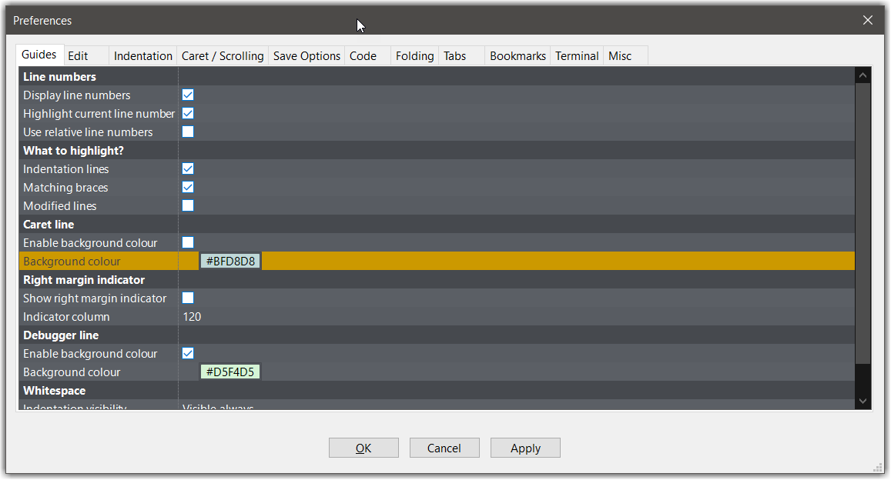
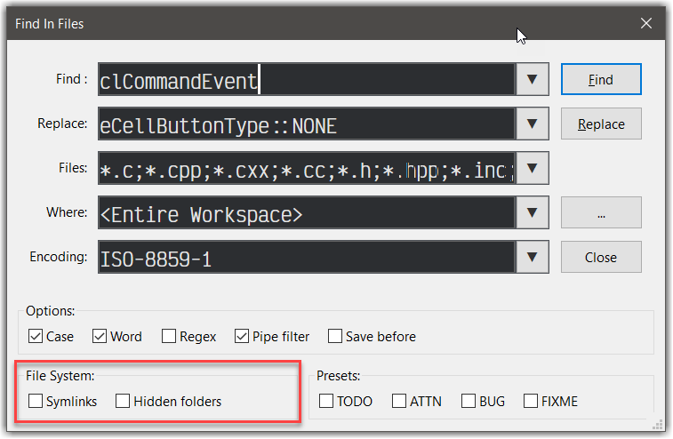
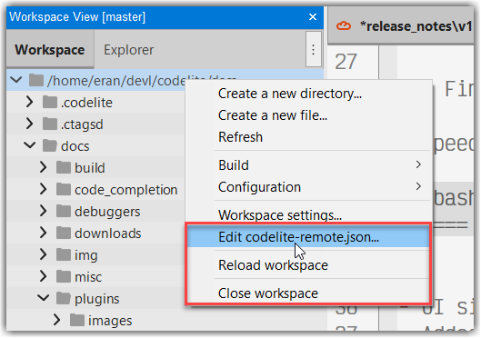

# CodeLite 17.0.0
---

## Downloads
---

As always, all downloads are available through our [download page][1]

## Bug fixes
---

- `codelite-ctags` is now built as part of CodeLite sources and is not provided as a prebuilt binary
- [ctagsd finds the wrong definition of a method][3]
- Respect user-supplied/alternate `wx-config` Alternate `wx-config` is not respected by `ctagsd` and `codelite-cli` subsystems (**Uffe Jakobsen**)
- Filesystem Workspace: Make `Build and Run Project` and `Rebuild Project` work with filesystem workspace (**rlbxku1r**)
- [restore frame attributes: `MAXIMIZE`, `FULLSCREEN`][4]
- Editor margin offset with fractional scaling enabled - this fixes [issue #3010][5] and [issue #2992][6]
- Fixed: CodeLite crashes when opening the resource dialog when no workspace is opened
- Fixed: CodeLite crashes when the LSP command is invalid
- Fixed the issue that `OpenFileAsync` would not trigger the callback function to open soft-linked files
- FIX: Git, The first commit failed (**liuanlin-mx**)
- fix:git plugin: show file diff, file path is incorrect (**liuanlin-mx**)
- git: add Show file Log  (**liuanlin-mx**)
- Fix: Replace All, Regular expressions don't work (**liuanlin-mx**)
- [Clicking the "Refresh" button in the FSW toolbar, refreshes the entire tree, unconditionally][10]
- Tab control navigation: use the same keyboard on all major platforms
- Tab control navigation dialog: show the dialog when using WSL2 on Windows
- Fix issue with "Open Resource..." searches containing `:line[:column]` When search pattern includes `:line[:column]` the current search only uses the filename - paths before the filename are ignored (**Uffe Jakobsen**)
- [fixed: Outline view is unreadable - bad colors][11]
- [Add support for Alacritty terminal emulator][12]
- [wxCrafter: Subclass of wxSpinCtrl crashes wxCrafter][13]

## Improvements
---

### macOS

- Keyboard shortcuts dialog: let user the shortcuts using either the ++ctrl++ or ++cmd++ keys

### Windows

- CodeLite is now using native dark mode (restart required between appearance changes)
- Attempt to locate `MSYS2` installation folder by checking the register entries first

### All platforms

- Source code formatter: added support for `cmake-format`
- CodeLite startup time improved
- Windows: `clangd` version bumped to 14
- Windows: CodeLite is now built with `clang-14` toolchain on Windows
- Windows: Installer now uses monolithic build of wxWidgets
- Updated the `Replace` UI to fit the other controls
- `Preferences` dialog has been re-written and now fits better on small screen, as a side bonus, it loads instantly
- Reloading a file opened remotely, now loads it from the remote server ( ++ctrl+r++ )
- Language Server plugin: LSP server detection code improvements
- [Code Formatter plugin][9]: the plugin was re-written. By default CodeLite now configure code formatters for:
    - C++ `clang-format`
    - JSON `jq`
    - XML `xmllint`
    - Rust `rustfmt`
    - PHP `php-cs-fixer & phpcbf`
    - Python `black`
- [Code Formatter plugin][9]: support "Format On Save": the user can now configure that the editor will be formatted after a save operation
- [Code Formatter plugin][9]: is now supporting invoking formatting on remote files opened via the Remoty plugin



- Hidden folders are now displayed in the UI using gray text and disabled image
- Remoty workspace tree view: added an option to copy a remote folder path
- File system workspace tree view: the top level folder no longer displays the fullpath, but rather that last dir name
- A modified tab now displays a round circle indicating that the file is modified
- **Windows**: Upgraded to `wxWidgets 3.2`
- **Windows**: CodeLite is now built with `clang`
- All template files have been updated to use the `dap` - [Debug Adapter Client][7] by default
- `Welcome Page` has been updated, mainly, the list of `Recently opened workspaces` now includes list of workspaces opened by other plugins (e.g. `Remoty`)

### Debug Adapter Client

- Since version 16.2.0, we introduced a new plugin: [Debug Adapter Client][7] - an implementation for the [Debug Adapter Protocol][8]. With this plugin, you can now debug, basically, any language.
- CodeLite auto detects and configures `lldb-vscode` (an adapter for the excellent `lldb` debugger) and `debugpy` (python debugger)
- The plugin supports the following views:
    - Call stack
    - Threads
    - Breakpoints (location & function based)
    - Local variables
    - Watches
    - Output pane
    - Module pane
    - Hover tips

### Find in files

- Speed improvement. For example, here is the outupt for searching for `clCommandEvent` in CodeLite sources:
- Fixed: when starting the search by right clicking a tree item, the search folder is set to the selected folders

```bash
====== Number of files scanned: 3717, Matches found: 1015, elapsed time: 1.651 seconds ======
```

- UI simplified
- Added option for searching in:
    - Hidden folders (off by default)
    - Follow symbolic links (off by default)

### Language Server Plugin ("code completion")

- Added support for the `Dart` language (**liuanlin-mx**)
- Code Completion Support for vim shortcut to page turning (++ctrl+n++, ++ctrl+p++, or ++ctrl+j++, ++ctrl+k++) (**liuanlin-mx**)
- Fixed Code completion dialog box not showing when cursor is at end of file (**liuanlin-mx**)



### Themes & Colours

- Added new themes:
    - Tokyo light
    - Tokyo dark
    - Tango dark
    - and others
- `C++` colouring: support colouring variables using a unique colour in addition to the classes, enums, structs etc

### Remoty plugin

- `codelite-remote` configuration lookup has been updated. [See the plugin page doc][2]
- `codelite-remote` added support for environment variables
- You can now edit the remote `codelite-remote.json` configuration file by right clicking on the top level folder of the workspace view
- Support workspace reload
- Remoty workspace view: added the following entries:
    - `Edit codelite-remote.json`
    - `Close workspace`
    - `Reload workspace`



## Other changes

- Windows: CodeLite is now built using `CMake`
- macOS: `codelite-terminal` is no longr shipped with CodeLite
- wxCrafter version is now the same version as CodeLite


[1]: https://downloads.codelite.org
[2]: /plugins/remoty/#configuring-code-completion
[3]: https://github.com/eranif/codelite/issues/2971
[4]: https://github.com/eranif/codelite/issues/3011
[5]: https://github.com/eranif/codelite/issues/3010
[6]: https://github.com/eranif/codelite/issues/2992
[7]: /plugins/dap
[8]: https://microsoft.github.io/debug-adapter-protocol/
[9]: /plugins/codeformatter
[10]: https://github.com/eranif/codelite/issues/3108
[11]: https://github.com/eranif/codelite/issues/3099
[12]: https://github.com/eranif/codelite/issues/3044
[13]: https://github.com/eranif/codelite/issues/3054
