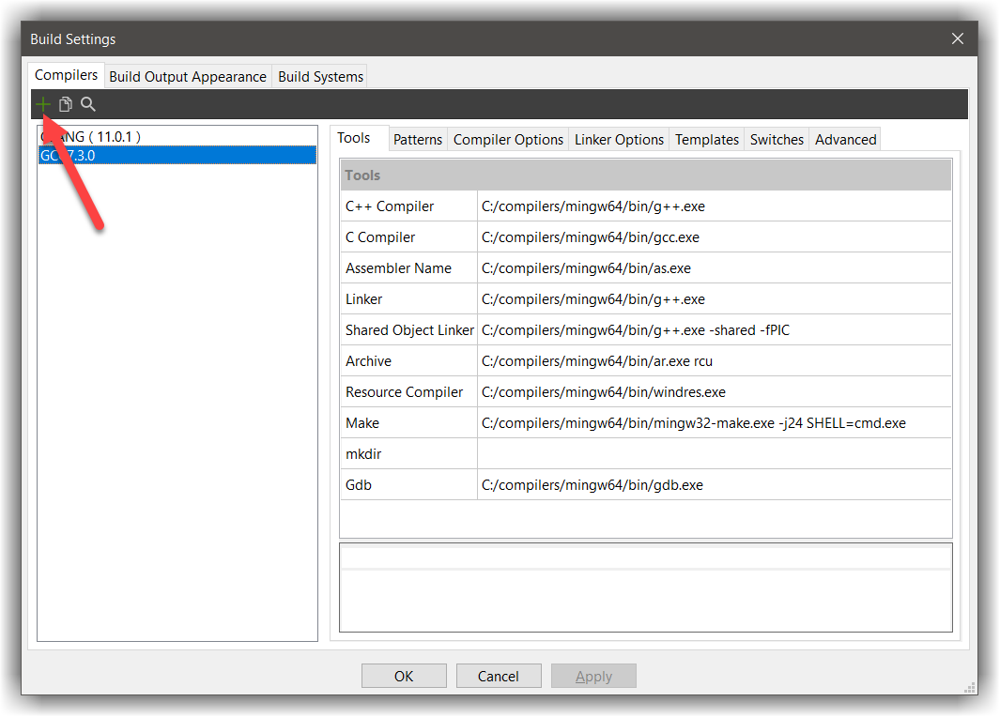
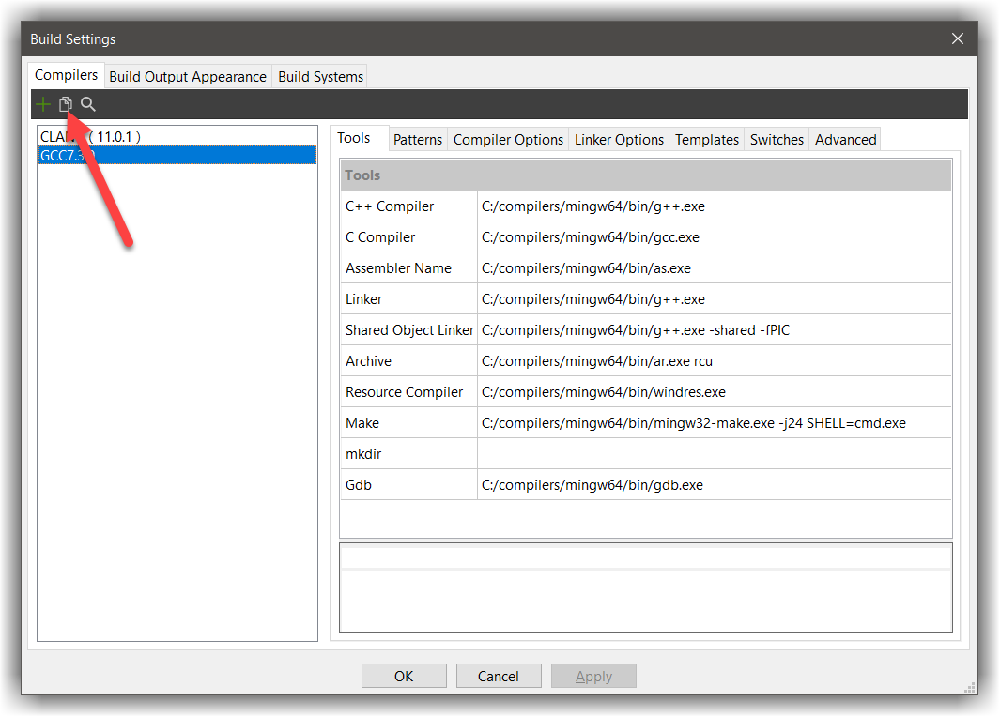
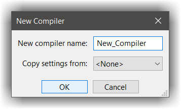
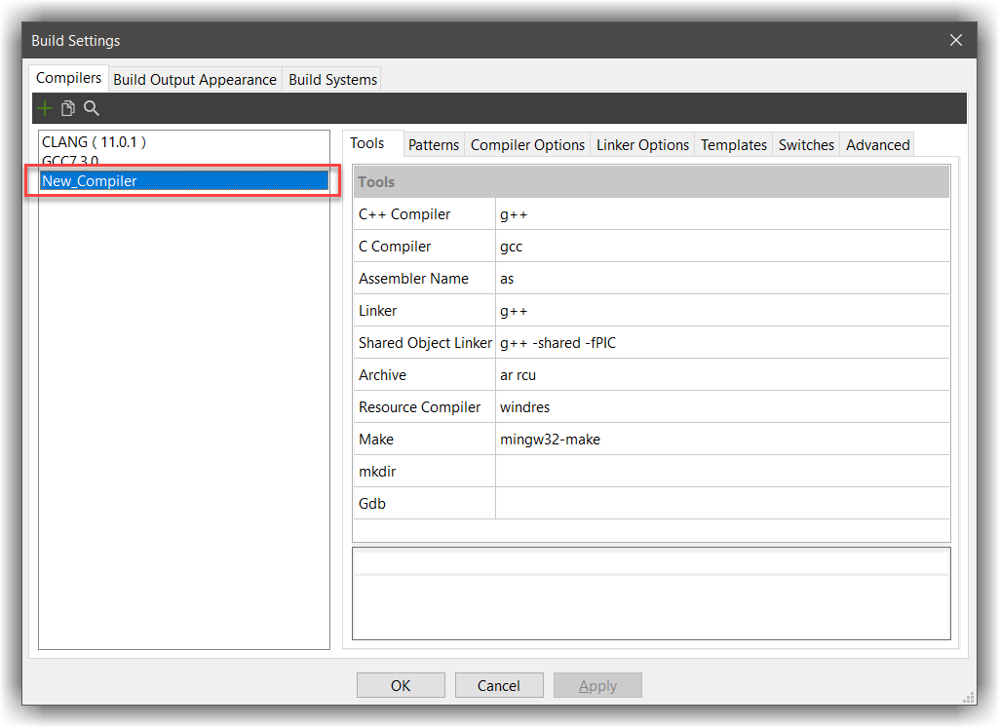

# Configuring a new compiler
---

CodeLite makes use of an existing compiler by defining the compiler toolchain.

## Automatic detection
----

To configure a new compiler and import it into CodeLite follow these simple steps:

* From the menu bar, open: `Settings` &#8594; `Build Settings` and click on the `+` button

* A folder selection window will show
* Navigate to your compiler `bin` folder and click `Select Folder` (or your platform equivalent button)

If a known compiler to CodeLite was found on that folder, CodeLite will configure it.
A known compiler is one of the following:

1. Any `clang` compiler
2. Any `gcc` compiler
3. Small number of `VC` compilers

## Manually adding a compiler
----

In case that the above step did not work for you, you can configure the compiler manually.

* While on the same dialogue, click the `Copy` button (as shown in the screenshot below) and fill information requested by CodeLite

* Update the various entries with the path to your actual tools located on your hard drive
* Your compiler is now configured and you can use it in from your `Project settings`