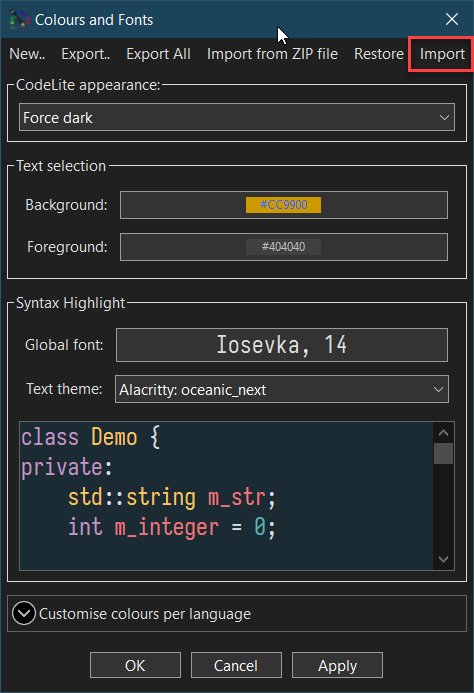

## Themes
---

CodeLite comes pre installed with the following list of themes:

- Light themes:
    - `Atom one light`
    - `Classic eclipse`
    - `Default`
    - `Roboticket`
- Dark themes:
    - `Gedit original oblivion`
    - `Inkpot`
    - `Monoaki Soda v3`
    - `Monoaki_2`
    - `Oblivion`
    - `Obsidian`
    - `One dark like`
    - `Pastel`
    - `RecognEyes`
    - `Retta light`
    - `Tomorrow Night`
    - `Wombat-redux`
    - `Zenburn`

You can switch between themes (or preview a theme) from: `Settings` &#8594; `Colours and fonts`

## Installing new themes
--- 

* Visit the [Eclipse Colour Themes web site][1] and search for a theme that you like
* Click on the theme that you want to install and download its `XML` format from the website:

* Open the `Colours and fonts` dialog from: `Settings` &#8594; `Colours and fonts`
* Click on the `eclipse` button, select the `XML` file you just downloaded and click OK:

* Congratulation, you have just installed a new theme!

## Tab Control Visualisation
---

On some platforms (Windows & macOS) CodeLite offers to ability to change the appearance of the tab control, as well
as their height and orientation

1. From the `Settings` &#8594; `Preferences` dialog, select the `Windows & Tabs` entry
2. Under the `Tabs` section, you can change the following:
    - Tab style
    - Tab height
    - Active tab marker colour
    - Workspace view tabs orientation
    - Output view tabs orientation

[1]: https://eclipse-color-themes.web.app/
