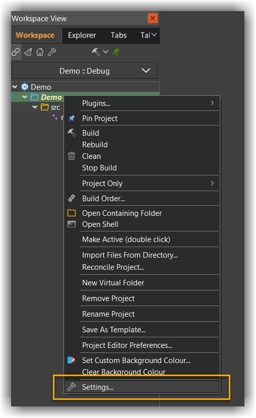
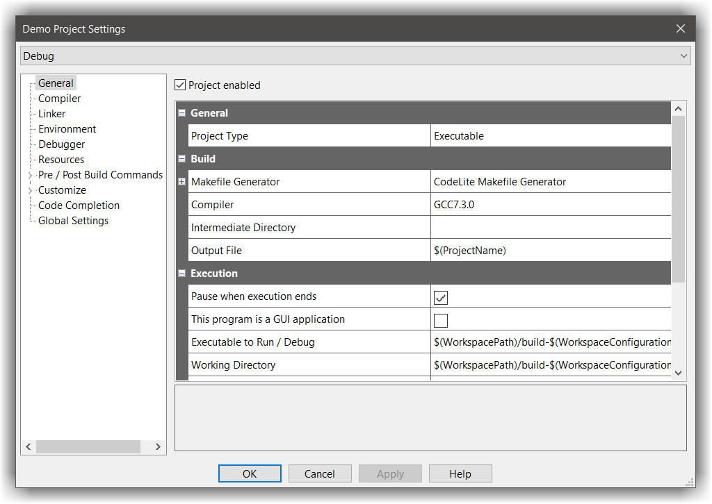
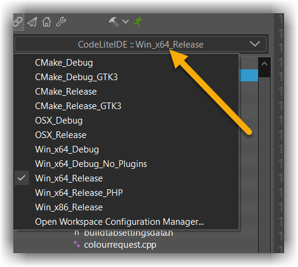
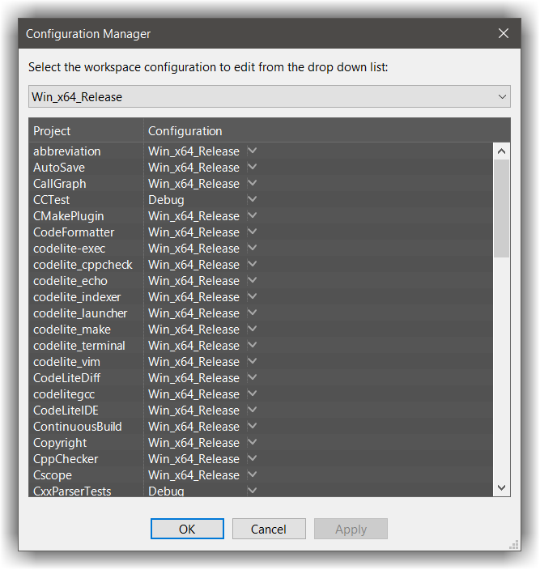
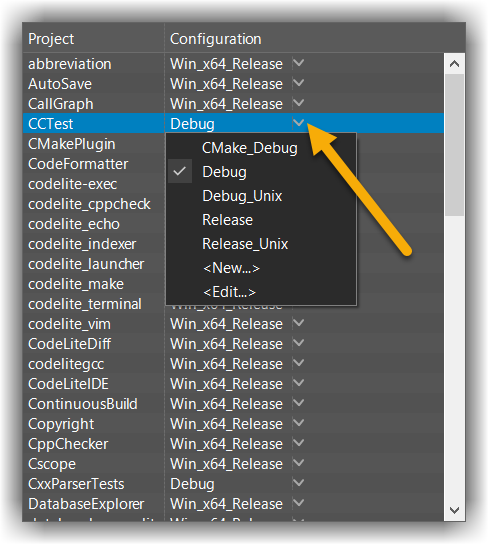

# C++ workspace
---

This is the recommended workspace when developing a `C/C++` project from scratch.
The C++ workspace organizes all the projects in a tree view

## Project
---

The workspace does not contain real information about your code.
Instead, all of your code info (how to build, what to build etc) is stored in the project file.

If you are familiar with `Makefile`, a project contains all the information needed to construct a `Makefile` to build
your code into a binary

Keeping the `Makefile` analogy, each project in the workspace defines a single build target, where a build target can be one of:

- Shared Object (`.so`, `.dylib` or `.dll` depends on the platform)
- Static library (`.a`)
- Executable 

Each project, may have multiple build configurations. For example, you may wish to build your executable with debug information
or optimized. So you would define two build configurations: one `Release` and another named `Debug`

To view the project settings, right click on the project and choose `Settings...`





### General
---

This page contains list of general information about the project

| Project property | Description |
|------------------|-------------|
|`Project enabled`  | enable or disable the project. A disabled project can still be built, but it is excluded from the workspace build |
|`Project type`|Determines the target type (as described above)|
|`Makefile Generator`| CodeLite offers multiple `Makefile` generators, the recommended value here is `CodeLite Makefile Generator`|
|`Compiler`| Choose to compiler to use by this project (more specifically, by this project configuration)|
|`Intermediate directory`| Sets the location of the object files. When `Makefile Generator` is used as the generator, this field is ignored|
|`Output File`| Sets the name of the output file|
|`Pause when execution ends`|When checked, CodeLite will run your program under a terminal which will pause before your program exits|
|`This program is a GUI application`| When checked, CodeLite will avoid wrapping your program with a terminal|
|`Executable to run / debug`|Set the executable to execute. This can be different value from the `Output File`|
|`Working directory`|Sets the working directory for the target execution / debug|
|`Program arguments`|Pass these arguments to the executed program|
|`Debugger`|Choose the debugger to use. Under Windows & Linux it is recommended to use the `GNU GDB Debugger` while under macOS, choose `LLDB`|
|`Use separate debugger args`|When checked, CodeLite will pass to the debugger the program arguments found under the `Debugger Program Arguments` rather than the ones that placed under the `Program Arguments` field|
|`Debugger Program Arguments`|Pass these arguments to the debugger program|

### Compiler
---

Contains all the information needed in order to **compile** your code (this is different from `Linking`):

| Project property  | Description |
|------------------|-------------|
|`Compiler is not required for this project` | enable this option if this project does not require compiling|
|`Use with global settings`| See [Global Settings below](#global-settings)|
|`C++ compiler options`|semi colon list of options to pass to the compiler when compiling a C++ source file e.g. `-g;-Wall;-std=c++17`|
|`C compiler options`|semi colon list of options to pass to the compiler when compiling a C source file e.g. `-g;-Wall`|
|`Assembler options`|semi colon list of options to pass to the compiler when compiling a `.s` file (assembly file)|
|`Include Paths`|semi colon list of directories to pass to the compiler for searching header files. It is recommended to use here relative paths, or use environment variables. e.g. `$(HOME)/includes;$(BOOST_DIR)/includes`|
|`Preprocessors`|semi colon list of macros (AKA `defines`) to the compiler, e.g. `USE_GUI=1;NDEBUG=1`|
|`Header file`|Path to the PCH file to use|
|`Explicitly include PCH`|When checked, CodeLite will include the PCH header file in the build command line using the `-include <pch-file>`|
|`PCH Compile flags`|Set here any special compiler options for the building the PCH file. **recommended to leave this empty**|
|`PCH Compiler flags policy`|CodeLite can use the `PCH compile flags` value in addition to the other compiler options as defined in `C++ compiler options` and `C compiler options`. You can set here the policy for how merge between the two|

### Environment
---

Set the environment variables to use when building / running this project.
You can set variables in two ways:

- Use a [pre-defined environment variables set](../../settings/environment_variables/#using-pre-defined-set)
- Manually set them for [using the same syntax as explained here](../../settings/environment_variables/#setting-global-environment-variables)

### Linker
---

| Project property | Description |
|------------------|-------------|
|`Use with global settings`| See [Global Settings below](#global-settings)|
|`Linker options`|semi colon list of options to pass to the linker e.g. `-pthread;-s`|
|`Libraries search path`|semi colon list of directories to pass to the compiler for searching libraries. It is recommended to use here relative paths, or use environment variables. e.g. `$(HOME)/lib;$(BOOST_DIR)/lib`|
|`Libraries`|semi colon list of libraries to link against. e.g. `boost_fiber;boost_system`|

!!! TIP
    When setting the `Libraries` field, there is no need to include the prefix `lib` or its prefix e.g. `.a`
    so if you want to link against `libboost_fiber.a` and `libboost_regex.a`, your `Libraries` field should look like:
    `boost_fiber;boost_regex`

### Debugger
---

This page allows to override the global debugger settings.
Settings that can be overridden here:

- Custom debugger executable
- Add debugger search paths for source files
- Custom start-up commands 
- Remote attach commands (executed after the debugger attaches a remote target)

You can also specify here if debugging over `gdbserver` by enabling the `Debugging a remote target`. You can [read more about `gdbserver` here][1]

### Resources
---

**Windows ONLY**

CodeLite inovke the `winres` compiler for `.rc` files on Windows to compile resources.
Here you can set search path and other resource compiler options (`windres`) similar to the [Compiler page](#compiler)

### Pre / Post Build commands
---

Run list of commands before or after the build process.
As part of the build command, you may use:

- Environment variables
- Project variables (click the `Help` button in the project settings dialog to get a full list of them)

The below example uses the project variable: `OutputFile` and the environment variable `HOME`:

```bash
echo Build of $(OutputFile) completed successfully!
echo my home dir is $(HOME)
```

### Customize / Custom 
---

**DEPRECATED** 
If you need to use a custom build. Please use the [File System Workspace](file_system.md) workspace

### Customize / Custom Makefile Rules
---

This page allows user to specify makefile rule(s) to be executed during the pre-build stage 
(actually, it will be executed before the commands provided in the `Pre Build` page).

!!! Important
    You must be familiar with makefile writing conventions to use this page.

The main difference between the commands executed in the `Pre Build` stage and the commands that will be executed in this rule, 
is that the commands in the `Pre Build` stage are executed unconditionally, while rules set here are executed based on their dependencies.

For example, lets assume that we have a project with a `yacc` & `flex` files that needs to be preprocessed by the `Yacc` & `Flex` tools 
before compilation starts

In the `Dependencies` line, set: `parser.cpp lexer.cpp`

While in the `Rule actions` we place this code:

```Makefile
## rule to generate parser.cpp based on grammar.y
parser.cpp: grammar.y
    @echo Generating parser.cpp and lexer.h ...
    yacc -dl  -t -v grammar.y
    mv y.tab.h lexer.h
    mv y.tab.c parser.cpp

## rule to generate lexer.cpp based on lexer.l
lexer.cpp: lexer.l
    @echo Generating lexer.cpp ...
    flex -L  lexer.l
    mv lex.yy.c lexer.cpp
```

### Global Settings
---

The global settings page contains list of properties that can be used with the following pages:

- Compiler
- Linker
- Resource compiler

On the above pages (`Compiler`, `Linker` and `Resources`) you can set the merging policy:

| Policy | Description |
|--------|-------------|
| Append | The page properties are appended to the global settings|
| Prepend | The page properties are prepended to the global settings|
| Overwrite | The page properties overwrite the global settings|

## The Configuration Manager
---

CodeLite supports multiple build configurations, i.e. you can build your code in Release, Debug or any other configuration that you have defined 
via the configuration manager (from menu, `Build` &#8594; `configuration Manager...`) 
To switch between the defined configuration, change the selection of the drop down button at the top of the workspace view:





The dialog has two sections, Workspace Configuration at the top, and Available Project Configurations below; 
the latter showing every project in this workspace. Let's start with Projects, as it'll be easier to understand that way

### Project Configurations
---

Each project is created with two default configurations, `Debug` and `Release`. 
If you open the drop down arrow right to the project entry, you'll see an entry for each of these, plus items `Edit` and `New`:



- `Edit` just lets you rename or delete an item. 
- `New` is more interesting. It brings up a dialog where you're asked for a name for the new configuration, and you also have the opportunity to clone the contents of one of the existing settings; this saves you from having to re-enter all the non-default data each time.

So why would you want to do this? Isn't having a `Debug` and a `Release` build enough for anyone? 
No, there are various other things you might want to do. You might decide to have a build that links to `wxWidgets` statically, 
and another dynamically; or a unicode build and an ANSI one. You might want to build your app as a library as well as an executable, 
and as either a static or a dynamic one.

Another reason for having multiple builds is multiple wxWidgets versions (if you're using CodeLite to create non-wxWidgets programs, substitute your own toolkit's name here ;). You probably have installed a recent version of wxWidgets stable, but what if you wish to make sure your project builds against wxWidgets svn trunk? Or to check compatibility with an older wxWidgets e.g. 2.6.4, or even 2.4.2?

Yet another reason: compiling on different platforms. If you build your project on `MSWindows`, `Linux` and `macOS`, you'll need a build (or several) for each.
So I've convinced you that you just must have a different available build for every day of the week. I suggest you give each a descriptive name e.g. `wx2.8.9ud`

### Project Settings
---
So far, you've just duplicated an existing build-type (or used the defaults), and given it a different label. 
Now you have to make `wx2.8.9ud` actually have 2.9 unicode debug settings. 
For this you use the Project Settings dialog. At the top of this dialog, change the Configuration Type combobox selection to `wx2.8.9ud` 
Then go through the tabs, altering any relevant settings (in this example, you'll need to make the entries on the Compiler and Linker tabs call a 2.9 unicode debug `wx-config`).
Your new project configuration is now available to use in a workspace build matrix. 

### Workspace Configuration
---

At the top of the Configuration Manager dialog is the Workspace Configuration combobox. 
This also comes with four entries: two default build matrices, `Debug` and `Release`, plus `Edit` and `New`. 
If you change the setting e.g. from Debug to Release, the project combobox(es) should change to match.


- Again: `Edit` lets you rename or delete an item. 
- This time, `New` just asks for a name for the new build matrix; it will usually make sense to give it the same name as the builds it will contain, so let's make one called wx2.8.9ud. Now select this in the Workspace Configuration combobox, and in the project combobox select wx2.8.9ud too. Click `OK` and your new configuration is ready.

You can change to a wx2.8.9ud build with just a mouse-click, by selecting it in the 'Selected Configuration' combobox in the Workspace View. Now building will use your 2.9 unicode debug wxWidgets installation instead of the normal one.

By now you're probably thinking that this is an over-complicated way to do things. Why not just change at the project level, and not bother with a workspace build matrix? As usual, for 'Hello World' you're right. But doing it this way gives you much more flexibility with larger, real-world apps. CodeLite itself is a good example of this. The workspace (currently) contains 18 projects. Two have a build (sensibly called 'common') that stays the same on each platform; but the other 16 have a build for MSWindows and another for Linux/Mac. Without the build-matrix idea, compiling for a different platform would mean changing the build type on 16 projects; with it, you need only to select a different build matrix, and each project is adjusted automatically. 

## Active project
---

All the default keyboard accelerators are applied to the **active** project.

*Example:*

If you hit ++f7++ to start the build process, it will build the **active** project 

## Debugging
---

### Starting the debugger

There are three sorts of debug session:

- Debugging the active project
- Attaching to an existing process
- Quick-debug

#### Debugging the active project

This is the normal sort of debugging. First, if your workspace contains more than one project, ensure that the active one is the desired project
with the project name shown in bold. If not, this can be changed by right clicking on the project and selecting `Set as active`

Then start the debugger by:

- Pressing ++f5++
- Clicking the appropriate tool in the Debug section of the main toolbar (the bug icon)
- From the main menu bar: `Debugger` &#8594; `Start/Continue Debugger`

CodeLite will start the debugger, automatically providing it with the following parameters:

- The executable to debug, taken from `Project Settings` &#8594; `General` &#8594; `Execution` &#8594; `Executable to Run / Debug`
- Once the debugger is successfully started, it will pass the program arguments [see the General page for info](#general)

#### Attach to a process

To select a process to debug, go to `Debugger` &#8594; `Attach to process`; this will open a dialog with all current processes listed. 
Select the one to be debugged. Debugging then continues as above

### Quick Debug

This is described in detail in [Debugging With Quick Debug](../debuggers/quick_debug.md)

[1]: https://sourceware.org/gdb/current/onlinedocs/gdb/Server.html