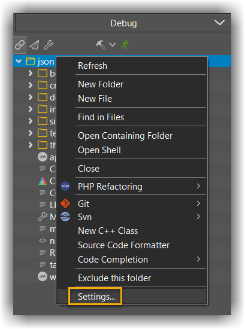
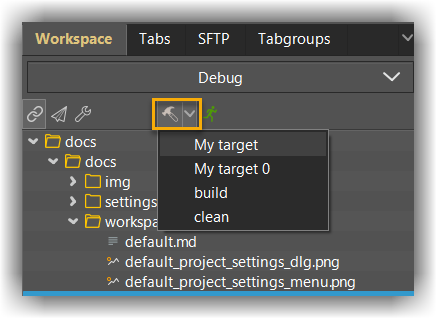

## When to use?
---

The workspace is intended for people who wish to use CodeLite for viewing, editing, debugging and code coding of an existing code base.
The tree view is filled automatically; there is no need to add files manually. Therefore it is very suitable for huge code bases.

## The tree view
---

Unlike the [default C/C++ workspace](default.md), this workspace offers no projects but is merely a reflection of the file system's current directory structure.
Also, any action on any folder in the tree view is applied to the file system (e.g. delete a file, folder etc).

## Set up
---

- From the `File` menu, select `New` &#8594; `New workspace`
- Choose `File System Workspace`
- Select the folder containing your code and give the workspace a name

## Settings
---

Open the settings dialogue by right clicking on the top level folder in the tree view and choose `Settings...`



### General
---

Here you can set the the following properties:

| Property              | Description                                      |
|:-------------------   |--------------------------------------------------|
| `Executable`          | A path to the executable to use when debugging or running your program. Note that if you choose to use relative paths here, it should be relative to the workspace file path|
| `Working directory`   | When running your program, use this path as the working directory. When left empty, the workspace path is used as the working directory|
| `Arguments`           | Arguments to pass to your program. One line per argument |
| `Tool chain`          | Choose the tool chain to use. Note that CodeLite uses the tool chain settings mainly for parsing build output|
| `Debugger`            | Choose the debugger to use |
| `File extensions`     | List of extensions to include in the workspace. Only files with the extensions specified here, are considered for code completion, find in files and other operations|
| `Exclude paths`       | List of folders to exclude from the workspace|

### Build
---

List here the build targets (if any). The default targets `build` and `clean` can not be deleted.
When clicking the build button (default accelerator ++f7++) CodeLite will execute the command specified for the `build` target.

You can add here as many targets as you wish. They are all accessbile from the `Build` drop down menu:



### Code Completion
---

The content of this page is used to generate the file `compile_flags.txt`
See more details about this file [here][1]

*Example*

Let's assume that your code uses header files from the following directories:

```bash
/home/you/includes
/home/you/boost/includes
```

and it requires the following macros:

```bash
USE_BOOST=1
USE_BOOST_FILESYSTEM=1
```

Then the content of the code completion should contains the following:

```bash
-I/home/you/includes
-I/home/you/boost/includes
-DUSE_BOOST=1
-DUSE_BOOST_FILESYSTEM=1
```

After setting the content, you can generate the `compile_flags.txt` file by right clicking on any folder in the tree view and choosing `Code Completion` &#8594; `Generate compile_flags.txt`

### Environment variables
---

Define here any environment variables you wish to use when working with this workspace [using the same syntax as explained here](../../settings/environment_variables/#setting-global-environment-variables)

### Remote
---

This page allows you to sync this workspace with a remote workspace using the SSH manager.
It enables the following features:

1. Every edit is synced to a remote file located on the remote machine
2. Optionally, you can choose that all the build commands are executed remotely and not locally (over SSH)

To enable this:

- Check the option `Enable remote development`
- Select the SSH account to use from the drop down list (or create a new one by using the ssh account manager)
- `Remote folder` : specify the path on the remote machine where the workspace file is located. Usually, you want the remote directory structure to be a mirror to the local one
- `Use remote build` : by checking this option, the build commands defined in the [build page](#build) are executed on the remote machine

[1]: https://releases.llvm.org/8.0.0/tools/clang/tools/extra/docs/clangd/Installation.html